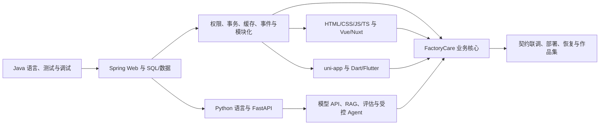

# 48 周完整学习路线：Java + Vue/Nuxt + 多端 + Python AI

## 1. 最终目标

用 48 个正式学习周形成一条可以验证的就业能力链：

> Java/Spring Boot 企业后端 + HTML/CSS/JavaScript/TypeScript/Vue3/Nuxt Web + uni-app 小程序 + Dart/Flutter App + Python/FastAPI/AI 应用 + SQL、测试、部署、排错与工程表达。

目标岗位按优先级排序：

1. Java + Vue 全栈工程师；
2. Java 应用开发 / 软件开发工程师；
3. AI 应用开发 / 企业智能化开发；
4. Vue3 / uni-app 前端工程师；
5. Flutter 作为已有作品资产和补充方向。

### 已知起点

- 约 2 年 HTML、CSS、JavaScript、TypeScript、Vue3 经验，学过 Nuxt；
- 学过约半年 Flutter/Dart并做过一个 App；
- 用 NestJS 做过两个 CRUD 项目；
- 接触过 Python、PyTorch、机器学习和深度学习概念；
- Java 尚未形成系统语言基础，Spring 从零开始；
- 会大量使用 Codex/Claude，但就业门槛是能审查、验证、修改和排错，而不是输入提示词。

### 时间与执行假设

- Week 00 是 8—12 小时准备周，不计入 48 个正式周；
- 正式周每周目标 15—18 小时，总预算约 720—864 小时；
- Week 01 为 2026-07-15—07-26，Week 02 起按 7 天目标窗口，目标完成日期 2027-06-20；
- 另预留 4 周机动期至 2027-07-18；
- 生活、工作或补考只延长当前周，不压缩知识依赖；
- 当前求职暂停。恢复求职后再启用并行节奏，不伪造过往投递或面试数据。

### 当前教学决定

- Java Week 01—08 从程序结构、输入输出、控制流和类开始，不假设 Spring；
- Web Week 22—25 系统补 HTML/CSS/JavaScript/浏览器/TypeScript，Vue 从 Week 26 开始；
- Dart Week 32—33 和 Python Week 36—38 单独学习语言，不把语法、OOP、异步和框架压成一周；
- 已会主题可以用基线题提速，但完整概念清单和项目证据不能跳过；
- 普通周用代码、测试、故障恢复、独立小改动和口述验收；综合无 AI 考核集中在阶段门；
- 版本进入阶段时从官方文档重新核对稳定补丁，概念周不追 nightly/preview。

### 非目标

- 研究型算法岗、预训练、RLHF、CUDA 和深度模型优化；
- 微服务/Kubernetes 平台专家或分布式系统专家；
- 同时深挖 React、多个 Java Web 框架和多个 Agent 框架；
- 用多个普通 CRUD Demo 代替一个持续加深的真实项目；
- 虚构商业经验、客户、生产规模、模型准确率或部署事实。

## 2. 路线选择理由

本路线以 Java/Vue 企业交付作为就业基本盘，以 Python AI 作为差异化，以 uni-app 和已有 Flutter 经历作为多端证据。学习顺序由依赖而不是热度决定：客户端与 AI 都依赖稳定的 API、权限、数据模型和错误契约，因此先建立 Java/SQL 核心，再扩展 Web、多端与 AI。

市场判断必须以 [job-market](./job-market/README.md) 中可追溯样本为限；样本不能证明整个南昌市场，也会随时间过期。求职恢复时重新采样，不用 2026 年旧数据替代当期事实。

## 3. 依赖图

## 4. 48 周总览

### Week 00：准备与基线（不计入正式周期）

- 统一 JDK/Maven/IDE，盘点而非一次安装全部工具；
- 完成 Java/JUnit 烟雾测试、受控版本冲突与恢复；
- 建立 Git、进度、AI 协作边界和 FactoryCare 项目词汇；
- 记录 SQL、Vue/TS、Python、Flutter 能力基线；
- 求职材料在暂停期间不阻塞 G0，恢复求职时重新验证。

### 阶段一：Java 语言基础（Week 01—08）

| 周次 | 主题 | 必须达到的结果 |
| --- | --- | --- |
| 01 | 程序结构、经典 `main`、控制台 I/O、类型、运算、方法、JUnit | 能读写最小 Java CLI，区分编译错误、运行时异常与测试失败 |
| 02 | String、null、数组、if/switch、for/while/do、方法设计与调试 | 能用控制流和数组表达完整小规则，并处理输入边界 |
| 03 | 类、对象、字段、构造器、`this`、访问控制、`static/final`、封装 | 能从过程代码建立有不变量的对象模型 |
| 04 | 继承、接口、抽象类、多态、组合、record、enum、值对象 | 能比较继承与组合，并用接口/值对象表达业务边界 |
| 05 | List/Set/Map/Deque、泛型、相等性、排序、内存仓储 | 能按语义选集合并避免 `equals/hashCode` 错误 |
| 06 | 异常、资源、NIO 文件、编码、时间、Clock、JSON | 能设计失败边界和安全导入导出 |
| 07 | Lambda、函数式接口、Stream、Collector、Optional | 能写/读数据管道并知道何时普通循环更清晰 |
| 08 | 线程、Executor、Future、虚拟线程、同步、JVM/GC/JFR 基础 | 能解释并发资源边界，完成 G1 纯 Java 综合题 |

阶段门 G1（Week 08）：关闭 AI 完成内存版工单服务，含类/对象、集合、异常、测试与小型并发读取；能修改规则、读失败日志并解释 Java 与 JS/TS 在类型、对象和并发上的差异。

### 阶段二：Spring Web 与数据（Week 09—15）

| 周次 | 主题 | 必须达到的结果 |
| --- | --- | --- |
| 09 | Maven 生命周期/依赖/插件/Wrapper；Spring Core、IoC/DI、Bean、配置 | 能解释构造器注入、容器边界和依赖方向 |
| 10 | Spring Boot Web、HTTP、REST、MVC、DTO、Validation、统一错误 | 完成设备/工单 API 的内存垂直切片 |
| 11 | JUnit、Mockito、MockMvc、Testcontainers、测试层次、OpenAPI | 建立单元、切片、集成与契约测试体系 |
| 12 | SQL 基础：DDL/DML、SELECT、过滤、JOIN、聚合、子查询/CTE、窗口 | 能手写岗位常见查询并解释执行顺序和 NULL |
| 13 | PostgreSQL 类型、关系建模、键、约束、规范化、迁移 | 建立租户、组织、用户、资产和工单基础表 |
| 14 | B-tree/复合/部分索引、EXPLAIN、MVCC、事务、隔离、锁、死锁 | 能通过实验解释慢查询和并发更新 |
| 15 | JDBC/连接池、MyBatis、动态 SQL、Flyway、事务垂直切片 | 从 HTTP 到 PostgreSQL 完成可测试链路并通过 G2 |

阶段门 G2（Week 15）：在现有项目中完成带迁移、DTO 校验、事务、错误格式和集成测试的设备停用需求；手写 SQL，解释索引、事务与 MyBatis 映射。另做 MySQL LTS 小型对照实验，但 FactoryCare 只维护 PostgreSQL 主实现。

### 阶段三：企业后端（Week 16—21）

| 周次 | 主题 | 必须达到的结果 |
| --- | --- | --- |
| 16 | Spring Security、密码、Session、JWT、OAuth2/OIDC、CSRF/CORS | 理解认证与授权，不自制不安全登录协议 |
| 17 | RBAC、数据范围、多租户隔离、审计 | 权限和租户规则由服务端强制并有越权测试 |
| 18 | 领域模型、聚合、12 状态工单、SLA、乐观锁 | 工单不再是任意修改 `status` 的 CRUD |
| 19 | Redis 数据结构/TTL、cache-aside、幂等、限流、一致性与降级 | Redis 故障不破坏业务事实 |
| 20 | 调度/异步、领域事件、Outbox、至少一次、RabbitMQ 概念 | 区分事务内事件、可靠外发和消息代理 |
| 21 | 模块化单体、Spring Modulith、模块测试、架构答辩 | 九个模块边界清晰并通过 G3 |

阶段门 G3（Week 21）：权限、租户、状态流转、乐观锁、幂等、审计和事件链有自动化证据；能解释为什么当前不拆微服务、何时值得拆以及迁移/回滚方式。

### 阶段四：Web、Vue3 与 Nuxt（Week 22—29）

| 周次 | 主题 | 必须达到的结果 |
| --- | --- | --- |
| 22 | HTML 语义、表单、原生校验、可访问性；CSS 层叠、盒模型、布局、响应式 | 不依赖 UI 库完成可访问的报修/筛选页面骨架 |
| 23 | JS 值/引用、作用域、函数、闭包、`this`、对象、原型、class、模块 | 能解释语言机制并实现纯 JS 状态转换 |
| 24 | DOM/事件、事件循环、Promise/async、Fetch/Abort、Storage/Cookie、Web 安全 | 能处理竞态、取消、组件外资源和浏览器边界 |
| 25 | TS 联合/交叉、泛型、收窄、`unknown/never`、utility、配置、运行时验证 | 能建立无 `any` 逃逸的 API/领域类型边界 |
| 26 | Vue SFC、模板、响应式、computed/watch、组件、生命周期、Composable | 能解释响应式和副作用生命周期，不只会套语法 |
| 27 | Vite、Router、URL 状态、Pinia、服务端状态、表单/表格/权限 | 完成管理端核心工作台 |
| 28 | Nuxt 4、SSR/CSR/SSG、hydration、数据获取、认证、SEO、Nitro 部署 | 完成公开知识门户垂直切片 |
| 29 | Vitest/Testing Library/Playwright、SSE、恢复、性能、可访问性回归 | Web 主链路可测试并通过 G4 |

阶段门 G4（Week 29）：管理端覆盖身份、资产、调度、工单、知识、SLA 和工单事件；有 loading/empty/error/success、权限、取消、重连、去重、会话过期和 E2E 证据。能解释浏览器事件循环、Vue 响应式、服务端状态和 Nuxt hydration 的不同层次。

### 阶段五：uni-app、Dart 与 Flutter（Week 30—35）

| 周次 | 主题 | 必须达到的结果 |
| --- | --- | --- |
| 30 | uni-app 运行模型、页面生命周期、路由、登录、扫码与幂等报修 | 建立报修人小程序垂直链路 |
| 31 | 真机、授权、隐私、上传、缓存、订阅/支付概念、分包与发布 | 完成至少一台真机可验证候选 |
| 32 | Dart 程序结构、变量/类型、空安全、运算、控制流、函数、集合 | 能用纯 Dart 编写和测试工单规则 |
| 33 | Dart 类/mixin/extension/sealed、泛型、异常、Future、Stream、isolate 概念 | 能解释异步、流、取消和对象模型 |
| 34 | Flutter Widget 树、约束布局、生命周期、导航、表单、状态管理 | 建立技师 App 的 UI/状态骨架 |
| 35 | 分层、Repository、REST/OpenAPI、认证、存储、离线队列、设备能力、测试、构建 | 完成技师主链路并通过 G5 |

阶段门 G5（Week 35）：小程序和 App 分别服务报修人与技师，至少完成真机演示；解释平台权限、离线草稿/缓存/同步队列、冲突、上传和认证恢复。无真机证据时明确标记未验证。

### 阶段六：Python 与 AI 应用（Week 36—43）

| 周次 | 主题 | 必须达到的结果 |
| --- | --- | --- |
| 36 | Python 运行、变量、类型、字符串、容器、条件/循环、函数、模块、基础 I/O | 能写有类型提示和测试的纯 Python 数据处理程序 |
| 37 | 类/数据模型/dataclass、异常、context manager、文件、iterator/generator、typing、pytest、uv | 建立可打包、可测试的 Python 工程 |
| 38 | async/await、task/取消、线程/进程边界、FastAPI、Pydantic、配置、日志 | 建立可观测 AI 服务骨架 |
| 39 | 监督/无监督、数据划分、指标、过拟合；Tensor、autograd、Module、推理 | 能读懂基础训练/推理，不转研究算法岗 |
| 40 | 模型 API、消息/上下文、结构化输出、流、工具调用、adapter、fake | 完成可替换且可测试的受控模型层 |
| 41 | 解析/OCR、切块、embedding、pgvector、全文/混合检索、引用与 ACL | 完成可重建、可撤回的 RAG 管线 |
| 42 | 固定评估集、检索/生成/引用/拒答指标、安全、成本、观测与降级 | 用数据证明优化并记录失败案例 |
| 43 | LangChain/LangGraph、state/checkpoint/HITL、MCP、工具权限和预算 | 完成有限、可恢复、可人工介入流程并通过 G6 |

阶段门 G6（Week 43）：Python 不能写 Java 核心业务表；AI 回答带来源、版本、无答案策略、租户 ACL、超时降级和评估记录；危险写操作回到 Java 并由人确认。

### 阶段七：集成与生产交付（Week 44—48）

| 周次 | 主题 | 必须达到的结果 |
| --- | --- | --- |
| 44 | OpenAPI/事件/SSE 契约、身份/租户/traceId、全端主流程与 E2E | 完成可重复的全链路业务闭环 |
| 45 | Linux 文件/权限/进程/网络、Docker 镜像/Compose、Nginx/TLS、CI/CD | 从开发机能跑升级为可重复构建和部署 |
| 46 | logs/metrics/traces、备份恢复、性能、安全、降级、8 类故障演练 | 通过生产化 G7，证据含现象到恢复全过程 |
| 47 | README、架构图、演示、系统设计、错题与多方向模拟面试 | 陌生读者能理解项目并经得起追问 |
| 48 | 范围冻结、全量验证、最终无 AI 需求/故障/答辩、发布与复盘 | 通过 G8 或形成明确的未验证清单 |

阶段门 G7（Week 46）：核心服务可重复部署，有结构化日志、指标/trace、备份恢复和故障演练；明确降级、回滚与未验证项。

最终门 G8（Week 48）：完成端到端无 AI 需求、两个随机故障定位和项目答辩。没有通过的能力不得写成“熟练掌握”。

## 5. 每周固定学习结构

建议把 15—18 小时拆成六类学习块：

1. **概念与官方资料（2—3h）**：理解当前切片需要的机制、约束和术语；
2. **代码阅读（2h）**：找到入口、类型、输入输出、状态、副作用和失败路径；
3. **最小实验（2—3h）**：先预测，再验证成功/边界/失败；
4. **项目增量（5—6h）**：先写行为和测试，再让 AI 协助一个小切片；
5. **测试与排错（2—3h）**：覆盖错误、越权、重复、超时、并发或恢复；
6. **独立改动与复盘（1—2h）**：关闭 AI 修改规则并口述。

时间不足时延长当前周。允许删扩展阅读，不允许删验证、失败路径和独立改动。

### 5.1 基础不是背语法

每门语言基础都使用同一证据循环：

- 读懂一段完整代码；
- 预测一处输出或失败；
- 自己输入/修改最小实现；
- 用测试或日志验证；
- 故意破坏一次并恢复；
- 把同一规则迁入 FactoryCare；
- 说明与已知语言类比在哪里成立、在哪里失效。

### 5.2 算法与计算机基础并行线

Week 01—21 每周 45—60 分钟，最多两道高质量题；Week 22 后每周一题或一次口述复习：

| 周次 | 主题 |
| --- | --- |
| 01—04 | 复杂度、数组、字符串、哈希、双指针 |
| 05—08 | 链表、栈、队列、排序、二分 |
| 09—12 | 树、堆、递归遍历、DFS/BFS |
| 13—16 | 滑动窗口、区间、回溯基础、Top K |
| 17—21 | 图的表达、贪心直觉、一维动态规划和综合复测 |
| 22—48 | 每周维护一道历史错题，优先真实薄弱项 |

每题说清输入输出、边界、复杂度、测试和至少一个替代方案，不做竞赛题海。

### 5.3 官方文档与技术英语

每周至少 30 分钟阅读当期官方英文资料，包含在概念时间中。先写自己的理解，再让 AI 解释难句；进入阶段时记录版本核对日期和链接。

## 6. FactoryCare 项目闭环

每个增量按同一流程：

1. 写角色、场景、业务价值、范围和非目标；
2. 明确数据、权限、信任边界和失败路径；
3. 写接口/事件契约与验收测试；
4. 重大设计比较 2—3 个方案，由人选择；
5. AI 一次只实现一个已确认的小切片；
6. 审查 diff 并运行静态检查、测试、构建和集成验证；
7. 主动验证失败、重复、越权、超时和并发；
8. 关闭 AI 完成小改动和口述；
9. 保存 ADR/复盘并小步提交。

项目不追求页面数量，而追求业务规则、权限、数据一致性、恢复和可解释 AI。权威范围见 [PROJECT_SPEC.md](./PROJECT_SPEC.md)。

## 7. 求职恢复后的并行节奏

当前暂停。用户明确恢复后按阶段启用：

- G1 前：只使用真实 Vue/TS 经验投递前端或 uni-app 相邻岗位；
- G1—G2：增加纯 Java、Spring Web、SQL 与测试的个人项目证据；
- G3：主投 Java/Vue 企业全栈和相邻 Java 应用岗；
- G4—G5：加入完整 Web、小程序、Flutter 演示；
- G6：增加 RAG、工具调用、评估和 Python 服务证据；
- G7—G8：集中模拟、投递、复盘和定向补缺。

合适 Offer 优先于机械学满 48 周；剩余周次可转为在职节奏。任何简历都区分商业经验、试用期经历和个人项目，不把学习项目包装成商业年限。

## 8. 版本与资料策略

- 2026-07-15 已核对：JDK 25 GA、Spring Boot 4.1、Node 24 LTS、PostgreSQL 18、Python 3.14、Nuxt 4、Flutter 3.44/Dart 3.12 均有官方稳定资料；
- 进入各阶段时重新核对稳定补丁、框架兼容矩阵和迁移说明；
- Java 使用 LTS，不启用 preview；Node 使用 LTS；Flutter 使用 stable；
- Java 依赖交给 BOM/Maven，Node 提交 `pnpm-lock.yaml`，Python 提交 `uv.lock`；
- 大版本升级单独定义影响、测试、迁移和回滚，不边学业务边追新；
- 教程与项目版本冲突时，以项目锁定版本和官方文档为准。

详见 [TECH_STACK.md](./TECH_STACK.md)。

## 9. 阶段回退与可就业节点

| 已通过 | 可展示/可主投 | 暂缓内容 | 恢复入口 |
| --- | --- | --- | --- |
| G1 / Week 08 | 原有 Vue + 可验证 Java 语言基础 | Spring/AI | Week 09 |
| G2 / Week 15 | Vue + Java Web/SQL 初级全栈 | 企业后端、多端、AI | Week 16 |
| G3 / Week 21 | Java/Vue 企业全栈核心 | 多端、AI 深入 | Week 22 |
| G4 / Week 29 | 完整 Java/Vue/Nuxt Web | 移动端 | Week 30 或按岗位跳至 Python 基础 |
| G5 / Week 35 | 多端企业全栈 | AI 深入 | Week 36 |
| G6 / Week 43 | Java/Vue/Python AI 应用 | 生产加固 | Week 44 |
| G7 / Week 46 | 可部署、可恢复候选 | 作品集完善 | Week 47 |

回退不是失败；未通过阶段门却继续堆框架才会积累不可控缺口。

## 10. 最终完成标准

### Java/Spring/数据

- 能解释并使用输入输出、类型、控制流、方法、类/对象、OOP、集合、泛型、异常、Stream、并发和 JVM 诊断入口；
- Spring Boot API 具备 DTO、校验、统一错误、事务、权限、审计和版本迁移；
- 能解释 DI、代理、事务失效、认证授权、缓存一致性和事件边界；
- 能手写常见 SQL、设计关系/约束/索引并读 `EXPLAIN (ANALYZE, BUFFERS)`；
- 核心业务有单元、集成、契约与 CI 证据。

### Web/多端

- 能独立写语义 HTML、可访问表单、CSS 布局和常用浏览器 JS；
- 能解释事件循环、Promise、取消、浏览器安全和 TypeScript 运行时边界；
- Vue/Nuxt 具备复杂表单、权限、错误状态、SSE、测试、E2E 和生产构建；
- uni-app 完成扫码报修、上传、进度和确认的真机链路；
- Dart/Flutter 完成技师接单、扫码拍照、离线记录、同步冲突和测试；
- 客户端不直接访问 Python、数据库或私有对象存储。

### Python/AI

- 能使用 Python 类型、函数、类、异常、文件、模块、async、pytest 和 uv；
- FastAPI 服务具备配置、类型、日志、超时、健康检查和测试；
- 能解释 ML/DL/PyTorch 基础，但不冒充算法工程经验；
- RAG 有固定评估集，至少 80 条正常、无答案、越权和注入样例；
- 回答带引用和版本，检索实施租户 ACL，模型故障可降级；
- Agent 有最大步数、预算、工具权限、checkpoint 和人工审批。

### 工程与表达

- Docker Compose 可重复启动核心依赖，CI 执行检查、测试和构建；
- 有结构化日志、关联 ID、指标/trace、备份恢复和至少 8 类故障演练；
- 有 README、架构/ER/状态图、API、ADR、测试、AI 评估和演示数据；
- 能进行 8 分钟产品演示、12 分钟架构讲解和 20 分钟追问；
- 无 AI 完成 2—3 小时端到端小需求并定位两个常见故障；
- 所有简历陈述能映射真实证据，并明确未验证事项。
