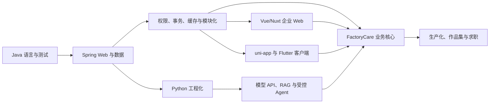

# 36 周完整学习路线：Vue/Nuxt + Java + 多端 + Python AI

## 1. 目标与范围

### 最终目标

用 36 个正式学习周形成一条可以验证的就业能力链：

> Vue3/Nuxt 企业 Web + Java/Spring Boot 核心业务 + uni-app 小程序 + Flutter 现场 App + Python AI 服务 + 数据库、测试、部署和排错。

目标岗位按优先级排序：

1. Java + Vue 全栈工程师；
2. Java 应用开发 / 软件开发工程师；
3. AI 应用开发 / 企业智能化开发；
4. Vue3 / uni-app 前端工程师；
5. Flutter 开发作为已有作品资产和补充岗位。

### 已知基础

- 约 2 年 HTML、CSS、JavaScript、TypeScript、Vue3 前端经验；
- 学过 Nuxt；
- 学过约半年 Flutter/Dart，并完成过一个 App；
- 用 NestJS 做过两个 CRUD 项目；
- 学过约两个月 Python、PyTorch、机器学习和深度学习概念；
- 准备大量使用 Codex/Claude 辅助开发，但仍需具备验证和接管能力。

### 时间假设

- 第 0 周是 8—12 小时的准备阶段，不计入 36 个正式学习周；它可以分散在正式开始前完成；
- 正式计划每周 15—18 小时，总投入约 540—650 小时；
- 允许工作、面试或个人事务导致单周延长，但不建议压缩知识依赖；
- 求职激活状态下从第 1 周维护岗位样本和投递，不等第 36 周才找工作；暂停状态按下方当前执行决定处理。

### 当前执行决定（2026-07-15）

- 当前暂停求职，岗位、简历、投递和面试任务保留但不阻塞技术周次；恢复时再启用第7节节奏；
- 学习采用[脚手架式项目执行方案](./STUDY_EXECUTION.md)：完整代码上下文 → 最小概念 → 运行/修改 → 测试/排错 → FactoryCare迁移；
- Java按L1起步，Week 01—06只学纯Java与测试，不假设Spring基础；Spring Core从Week 07开始，Spring Boot Web从Week 08开始；
- 普通周以代码、测试、故障恢复和独立小改动验收，不突然进行脱离项目的低频理论考试；综合考核集中在阶段门；
- 日期是目标窗口，是否进入下一周仍以证据为准。

### 非目标

- 研究型算法岗、预训练、RLHF、CUDA 和深度模型优化；
- 微服务专家、Kubernetes 平台工程师或分布式系统专家；
- 同时精通多个前端框架和多个 Agent 框架；
- 用五个独立 Demo 代替一个真实项目；
- 伪造商业经验、工业客户、模型准确率或生产规模。

## 2. 为什么选择这条路线

截至 2026 年 7 月，南昌公开岗位样本显示，Java 企业应用仍是本地较宽的后端基本盘；同一招聘聚合平台按职位标题统计的南昌 Java 记录中，1—3 年和 3—5 年岗位占主要部分，薪资样本大量落在 8K—15K。该数据存在重复、过期和标题遗漏，只用于判断方向，不能当成精确市场份额。[南昌 Java 样本](https://www.jobui.com/salary/nanchang-java/)

本地公开职位常见组合包括 Spring Boot、MyBatis、MySQL、Redis、权限、Linux/Docker，以及 Vue2/3、TypeScript、小程序或 uni-app；例如博云招聘同时列出 Vue/小程序/uni-app 与 Java Spring 生态要求。[博云招聘](https://www.bocloud.com.cn/joinus/)

南昌也已经出现 AI 自动化、Agent 和大模型应用岗位，但要求通常不是只会调用聊天接口，而是文档处理、RAG、工具调用、FastAPI、评估、权限、日志、成本和部署。[南昌 AI 岗位样本](https://www.zhaopin.com/sou/jl691/kwDNOLT9IRCP760)

因此，本计划把 Java/Vue 企业交付作为就业基本盘，把 Python AI 作为差异化，把 uni-app 和已有 Flutter 作为多端交付证据。Nuxt用于补齐 SSR、SEO和产品型 Web 能力，但不把本地低频关键词当成主线。

## 3. 学习依赖图

顺序的核心原因：AI、移动端和前端都依赖稳定的业务 API、权限和数据模型。如果业务核心还不可靠，继续堆 Agent 或客户端只会放大返工。

## 4. 36 周总览

### 第 0 周：准备与基线（不计入正式周期）

- 阅读本工作区全部入口文档；
- 按需统一 JDK 25 LTS、Maven、Node LTS、pnpm、Python/uv 和 Flutter Stable；
- 完成 Java、SQL、Vue、Python、Flutter 基线测验；
- 采样至少 40 个南昌及周边岗位；
- 建立 Git、周复盘、求职跟踪和 AI 协作规则。

### 阶段一：Java 语言与计算机基础（Week 01—06）

| 周次 | 主题 | 主要结果 |
| --- | --- | --- |
| 01 | Java 语法、类型、控制流、JUnit | 能写带测试的基础程序，不把 Java 当成 TypeScript 换语法 |
| 02 | OOP、接口、record、enum、值对象 | 建立设备和工单的内存领域模型 |
| 03 | 集合、泛型、对象相等 | 正确选择 List/Set/Map 并处理 equals/hashCode |
| 04 | 异常、IO、时间、JSON | 能设计错误边界并处理文件与序列化 |
| 05 | Lambda、Stream、Optional | 能进行集合变换，同时识别链式滥用 |
| 06 | 并发、虚拟线程、JVM 基础 | 理解线程安全、线程池、内存区域、GC 与诊断入口 |

阶段门 G1：关闭 AI 完成一个内存版工单需求，含测试、异常和集合操作；能解释 Java 与 JS/TS 在类型、对象、异常和并发上的关键差异。

### 阶段二：Spring Web 与数据持久化（Week 07—12）

| 周次 | 主题 | 主要结果 |
| --- | --- | --- |
| 07 | Maven、Spring Core、IoC/DI、配置 | 理解容器、Bean 生命周期和依赖注入边界 |
| 08 | Spring Boot Web、REST、DTO、校验 | 完成统一错误格式的设备/工单 API |
| 09 | JUnit、Mockito、MockMvc、Testcontainers、OpenAPI | 建立单测、切片测试和集成测试层次 |
| 10 | PostgreSQL、关系建模、SQL | 建立租户、组织、用户、资产和工单基础表 |
| 11 | 索引、EXPLAIN、事务、隔离与锁 | 能用实验解释慢查询、幻读和并发更新 |
| 12 | MyBatis、Flyway、持久化垂直切片 | 从 HTTP 到数据库完成一条可测试业务链 |

阶段门 G2：在无 AI 条件下，120 分钟完成一个带数据库迁移、校验、事务、错误处理和集成测试的接口；能解释索引、事务边界和 MyBatis 映射。

就业桥接：Week 12集中用2小时完成MySQL 8.4 LTS小型对照实验，理解InnoDB聚簇索引、MVCC、锁、字符集和主要SQL差异；FactoryCare仍只维护PostgreSQL主实现，避免双数据库兼容层稀释深度。

### 阶段三：企业后端能力（Week 13—18）

| 周次 | 主题 | 主要结果 |
| --- | --- | --- |
| 13 | Spring Security、Session、JWT、OIDC | 理解认证与授权，不手写不安全登录框架 |
| 14 | RBAC、多租户、数据权限、审计 | 实现租户隔离、角色权限和关键操作审计 |
| 15 | 领域建模、状态机、SLA、乐观锁 | 工单不再是任意修改 status 的 CRUD |
| 16 | Redis、缓存、幂等、限流、一致性 | 实现安全的重复提交防护和可解释缓存 |
| 17 | 异步任务、领域事件、Outbox、消息概念 | 区分事务内事件、可靠外发和消息队列 |
| 18 | 模块化单体、Spring Modulith、架构考核 | 建立清晰模块边界并验证依赖方向 |

阶段门 G3：完成 Java 模块化单体核心；权限、事务、状态流转、幂等、审计和至少一个事件链有自动化测试。能说明为什么当前不拆微服务，以及将来什么信号才值得拆。

### 阶段四：Vue3 与 Nuxt Web（Week 19—22）

| 周次 | 主题 | 主要结果 |
| --- | --- | --- |
| 19 | Vue3、TypeScript、响应式、Composable 复健 | 把既有经验升级到可解释的组件边界和副作用管理 |
| 20 | Router、Pinia、服务端状态、复杂表单表格、权限 | 完成管理端主工作台和状态管理策略 |
| 21 | Nuxt 4、SSR/CSR/SSG、水合、数据获取、SEO | 完成公开设备知识门户或产品站垂直切片 |
| 22 | Vitest、组件测试、Playwright、SSE、错误恢复 | 完成可测试的流式 UI、取消、重试和异常状态 |

阶段门 G4：Web端覆盖登录、组织/角色最小管理、资产、调度、工单、知识发布/撤回、SLA只读看板和工单事件SSE；关键组件、权限和主链路有自动化测试。AI回答流留到Week 29—31。能解释Vue响应式、Nuxt水合和服务端状态的差别。

### 阶段五：uni-app 与 Flutter（Week 23—26）

| 周次 | 主题 | 主要结果 |
| --- | --- | --- |
| 23 | uni-app Vue3、小程序运行模型和扫码报修 | 建立报修人小程序垂直链路 |
| 24 | 真机、授权、上传、缓存、推送/支付概念、发布 | 完成可真机验证的小程序候选版本 |
| 25 | Dart/Flutter 复健、状态和官方应用架构 | 重建现场技师 App 的清晰分层 |
| 26 | OpenAPI、离线存储、同步、扫码拍照、测试、构建 | 完成技师接单、离线处理和同步关键链路 |

阶段门 G5：uni-app 和 Flutter 分别服务报修人与现场技师，至少完成真机演示；能够解释平台权限、离线数据、冲突、上传和认证恢复。

### 阶段六：Python 与 AI 应用（Week 27—32）

| 周次 | 主题 | 主要结果 |
| --- | --- | --- |
| 27 | Python 3.14 工程化、typing、async、uv、pytest、FastAPI | 建立可测试、可观测的 AI 服务骨架 |
| 28 | ML/DL/PyTorch 概念复健 | 能读懂基础训练/推理流程，但不转向算法岗 |
| 29 | 模型 API、上下文、结构化输出、流、工具调用 | 完成可替换模型的受控调用层 |
| 30 | 文档解析、切块、Embedding、pgvector、混合检索、引用 | 完成带 ACL 和来源引用的 RAG |
| 31 | RAG 评估、重排、安全、成本、降级和观测 | 用固定数据集证明优化，而不是凭感觉演示 |
| 32 | LangChain/LangGraph、Workflow/Agent、HITL、MCP | 完成一个有必要、可恢复、只读优先的 Agent 流程 |

阶段门 G6：Python不直接写Java核心数据库；AI回答带来源、无答案策略、租户过滤、超时降级和评估记录；危险写操作必须回到Java并由用户确认。

### 阶段七：集成、生产化和求职发布（Week 33—36）

| 周次 | 主题 | 主要结果 |
| --- | --- | --- |
| 33 | Java、Python、Web、App、小程序全链路与 OpenAPI 契约 | 完成端到端主业务和契约校验 |
| 34 | Docker、Linux、Nginx/TLS、CI/CD、OTel、备份恢复 | 建立可重复部署和故障演练证据 |
| 35 | 作品集、架构讲解、系统设计和多方向模拟面试 | 形成按岗位定制的展示材料 |
| 36 | 发布候选、最终无 AI 考核、集中投递与复盘 | 达到求职交付标准或形成明确缺口清单 |

阶段门 G7（Week 34）：核心服务可以重复部署，具备结构化日志、基本观测、备份恢复和故障演练证据；关键故障有明确降级与回滚路径。

最终门 G8（Week 36）：完成本文件第 10 节的全部核心标准。未达到的项必须标记为“未验证”，不能在简历中写成掌握。

## 5. 每周固定执行结构

建议把 15—18 小时拆成 6 个学习块，而不是机械规定每天必须学：

1. **定向概念（2h）**：只学习完成当前代码切片需要的概念，并说明与TS/Vue类比的边界；
2. **已有代码阅读（2h）**：指出入口、类型、输入输出、状态、副作用和失败路径；
3. **最小实验（2—3h）**：在完整可运行代码中验证一个机制，并主动制造一个错误；
4. **项目块（5—6h）**：先写行为与测试，再让AI协助实现一个FactoryCare小切片；
5. **测试与排错（2—3h）**：覆盖边界、故障注入、日志定位和恢复；
6. **独立小改动与复盘（1—2h）**：不重新生成整个功能，独立修改一条规则并记录证据。

如果本周只能投入 8—10 小时，保留定向概念、已有代码阅读、一个项目切片、测试和独立小改动，删除扩展阅读；不要删除验证。

### 5.1 并行的算法与计算机基础线

算法不单独占用一个月，也不能等到Week 35才第一次准备。Week 01—18每周从“无AI/求职”时间中拿出45—60分钟，最多完成2道高质量题；Week 19以后每周保持1道或一次口述复习。

| 周次 | 主题 |
| --- | --- |
| 01—03 | 复杂度、数组、字符串、哈希、双指针 |
| 04—06 | 链表、栈、队列、排序、二分 |
| 07—09 | 树、堆、递归遍历、DFS/BFS |
| 10—12 | 滑动窗口、区间、回溯基础 |
| 13—15 | 贪心直觉、Top K、图的基础表达 |
| 16—18 | 一维动态规划基础、综合复测 |
| 19—36 | 每周1题维护；优先复习真实面试薄弱项 |

每题要求说明输入/输出、边界、复杂度、测试和至少一个替代方案。目标是常见面试与代码思维，不做竞赛题海。

### 5.2 Web基础审计线

Week 19不是从头重学前端，但开始Vue阶段前必须用2小时完成无AI基线：

- 语义化HTML、表单、可访问性；
- CSS层叠、盒模型、Flex/Grid、定位和响应式；
- JavaScript作用域、闭包、原型、模块、事件循环和Promise；
- DOM事件、Fetch/Abort、Cookie/Storage、CORS/CSRF/XSS；
- TypeScript联合/泛型/收窄/`unknown`和运行时验证边界；
- 浏览器渲染、缓存和性能基础。

通过项直接略过；失败项在Week 19—22的FactoryCare切片中补，不重新观看整套入门课程。完整审计见[全技术栈概念矩阵](./CONCEPT_MAP.md)。

### 5.3 官方文档与技术英语

每周至少30分钟阅读当期官方英文文档：先写自己的理解，再让AI解释难句。保留关键术语的中英文对应，避免只会背中文二手教程。它包含在概念块内，不额外增加总时长。

## 6. 贯穿全程的项目方法

每个项目增量使用同一闭环：

1. 写用户角色、场景和业务价值；
2. 写范围、非目标、数据和权限边界；
3. 写接口或事件契约及验收测试；
4. 让 AI 比较 2—3 个实现方案；
5. 人选择后，AI一次只实现一个小切片；
6. 检查 diff，运行静态检查、测试和构建；
7. 主动验证失败、重复、越权、超时和并发路径；
8. 关闭 AI 完成小改动并口述；
9. 记录 ADR 或周复盘，小步提交。

项目不追求页面数量，而追求业务规则、权限、数据一致性、故障恢复和可解释AI。详细范围见 [PROJECT_SPEC.md](./PROJECT_SPEC.md)。

## 7. 求职并行节奏

当前状态为暂停。以下节奏只在用户明确恢复求职后启用；暂停期间不影响技术阶段门，也不把未完成简历写成已完成。

- Week 00—06：维护 Vue3/TypeScript 主简历，少量投递 Vue/uni-app 岗，验证市场和简历；
- Week 07—12：增加 Java 基础、Spring Web、SQL 和测试证据，开始投 Java+Vue/初级 Java；
- Week 13—18：以权限、状态机、事务、缓存和部署扩大全栈岗位；
- Week 19—26：加入完整 Web、小程序、Flutter 多端演示；
- Week 27—32：增加 RAG、工具调用、评估和 Python 服务，投 AI 应用岗位；
- Week 33—36：集中投递、模拟面试、复盘和定向补缺。

不规定必须学满 36 周才能入职。合适 offer 优先，剩余路线转换为在职学习。

完整策略见 [JOB_SEARCH.md](./JOB_SEARCH.md)。

## 8. 版本与资料策略

- 进入某阶段时，从官方文档确认稳定版本并记录在锁文件；
- 学习期内只做安全更新、bugfix和有验收标准的升级，不追逐 nightly；
- Java使用当前最新 LTS，而不是非 LTS 最高版本；
- Node使用 Active/Maintenance LTS；
- Flutter使用 stable channel；
- Python库用 `uv.lock`，Node用 `pnpm-lock.yaml`，Java依赖交给BOM和Maven锁定策略；
- 教程版本与项目不一致时，以项目锁定版本和官方迁移说明为准；
- 每次大版本升级单独写迁移目标、测试、影响和回滚，不边学业务边盲升依赖。

详见 [TECH_STACK.md](./TECH_STACK.md)。

## 9. 回退与恢复节点

36 周是理想完整路线，不是必须一次到底。出现经济压力、工作机会或精力问题时：

| 已完成阶段 | 可以主投 | 暂缓内容 | 恢复方式 |
| --- | --- | --- | --- |
| G1 / Week 06 | 原有 Vue 前端 | Java框架、AI | 入职后从Week 07继续 |
| G2 / Week 12 | Vue + Java Web 初级全栈 | 多端、AI | 保留API项目，从Week 13继续 |
| G3 / Week 18 | Java/Vue企业全栈 | Flutter、AI深入 | 先补Web展示，再恢复Week 19 |
| G4 / Week 22 | Vue/Nuxt + Java全栈 | 移动端 | 直接进入AI或按岗位补跨端 |
| G5 / Week 26 | 多端企业全栈 | AI深入 | 先发布无AI业务版，再从Week 27增量 |
| G6 / Week 32 | Java/Vue/Python AI应用 | 生产化加固 | 先投递，Week 34内容按面试缺口补 |

回退不是失败；没有通过阶段门却假装完成并继续堆框架，才会积累不可控缺口。

## 10. 最终完成标准

### Java与企业后端

- 能解释并使用Java类型、OOP、集合、泛型、异常、Stream、并发和JVM诊断入口；
- Spring Boot API具备DTO、校验、统一错误、事务、权限、审计和版本化迁移；
- 能解释Spring代理、事务失效、依赖注入、认证授权和缓存一致性；
- 能设计关系模型、索引并使用`EXPLAIN (ANALYZE, BUFFERS)`定位一个慢查询；
- 核心业务具备单元测试、集成测试和CI。

### Web与多端

- Vue Web具备复杂表单、权限、错误状态、SSE取消重试和E2E；
- 能解释Nuxt的SSR、CSR、SSG、水合、数据获取和部署边界；
- uni-app完成扫码报修、上传、进度和确认评价的真机链路；
- Flutter完成技师接单、扫码拍照、离线记录和同步冲突的关键链路；
- 三端不直接访问Python、数据库或私有对象存储。

### Python与AI

- Python服务具备类型、配置、测试、日志、超时和健康检查；
- 能解释模型上下文、结构化输出、流式传输、工具调用、RAG和Agent/Workflow区别；
- RAG使用固定评估集，至少80条正常、无答案、越权和注入样例；
- 回答带引用和版本信息，检索实施租户ACL；
- 模型不可用时业务主链路仍能降级运行；
- 人工审批和Java业务规则控制所有高风险写操作。

### 工程、表达与求职

- Docker Compose可一键启动核心依赖，CI执行检查、测试和构建；
- 有结构化日志、关联ID、基本指标、备份恢复和至少4类故障演练；
- 有README、架构图、ER图、API文档、ADR、测试报告、AI评估报告和演示数据；
- 能进行8分钟产品演示、12分钟架构讲解和20分钟追问；
- 无AI完成一项2—3小时的端到端小需求，并定位一个常见故障；
- 累计至少120次定向投递或提前获得合适offer；
- 简历区分商业Vue经验与个人Java/AI项目经验，不虚构年限。

## 11. 明确保留到工作后再学

- Spring Cloud全家桶、服务治理和复杂分布式事务；
- Kafka深度调优、Kubernetes、Service Mesh；
- JVM源码、GC专家级调优；
- Flutter原生插件深度开发和多平台桌面适配；
- 小程序复杂直播、游戏和深度电商能力；
- 模型训练、微调、量化、CUDA和GPU集群；
- 多Agent组织、自动自治写操作和自托管大模型平台。

这些内容会在计划中解释“是什么、何时需要”，但不会为了所谓全面而消耗主要项目时间。
