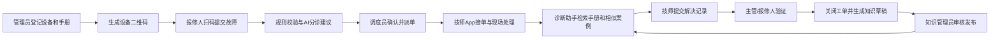
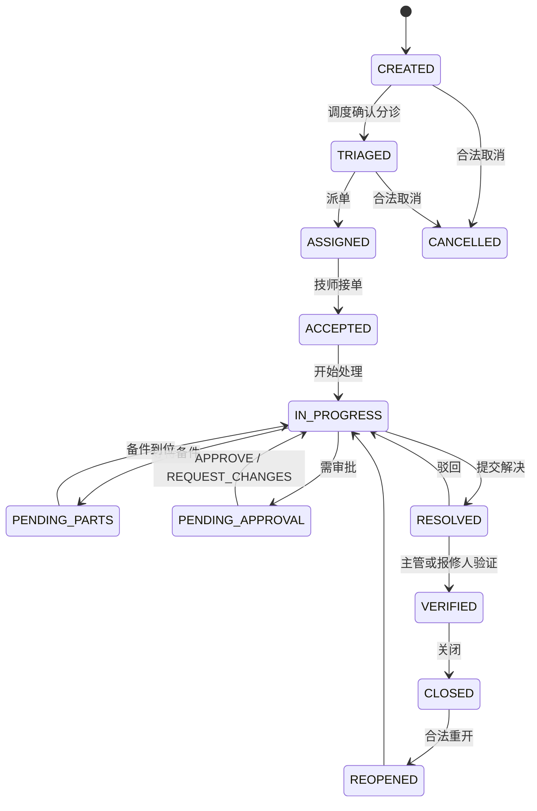
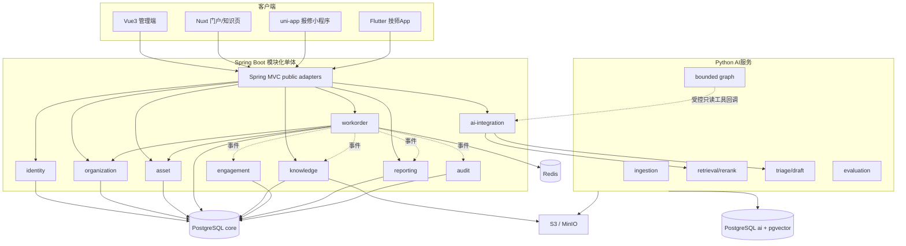

# FactoryCare：多租户设备运维与智能工单平台

## 1. 项目目的

FactoryCare不是一个带侧边栏聊天框的CRUD后台，而是贯穿48周的求职旗舰项目。它要证明：

- 能把真实业务规则建模为状态、权限、事务和事件；
- 能用一个Java模块化单体支撑Web、App和小程序；
- 能设计移动离线、附件和跨端一致性；
- 能让Python AI提供可评估、带证据、可降级的能力；
- 能测试、部署、观察、备份、恢复和解释整个系统；
- 能使用AI提高实现速度，同时对结果负责。

项目面向制造业设备运维、园区设施、电力设备、售后现场服务等相邻场景。演示数据使用公开授权的设备资料和自建脱敏数据，不声称拥有真实工业客户或真实预测性维护准确率。

> **当前状态与所有权：** 本文件定义学习者将在后续周次逐步实现的目标系统，不表示完整 FactoryCare 已经存在。课程仓当前负责施工前设计合同、八阶段教学路线、负向场景和可执行验收框架；真实垂直切片、集成系统及 `evidence/factorycare/**` 下的运行、测试、决策和复述证据必须由学习者到达对应阶段后产生，不能由课程建设过程预填或冒充学习成果。

## 2. 产品角色

| 角色 | 主要终端 | 核心职责 |
| --- | --- | --- |
| 租户管理员 | Vue Web | 组织、用户映射、角色、数据范围和系统配置 |
| 资产管理员 | Vue Web | 设备型号、资产、位置、二维码、维护基线和手册 |
| 调度员 | Vue Web | 分诊确认、派单、转派、SLA跟踪和异常处理 |
| 知识管理员 | Vue/Nuxt Web | 文档发布、版本、AI知识草稿审核和撤回 |
| 现场技师 | Flutter App | 接单、扫码、离线检查、拍照、工时、备件和解决记录 |
| 报修人 | uni-app小程序 | 扫码报修、补充信息、查看进度、确认解决和评价 |
| 审计/主管 | Vue Web | 审计记录、SLA、质量指标和AI采纳率 |

所有成员都属于一个租户和组织，可选属于该组织下的一个班组。七个业务角色是平台固定catalog，租户只绑定角色，不自定义或改写catalog。租户之间数据必须隔离；角色决定能做什么，数据范围决定能看哪些组织、班组、设备和工单。`TEAM`范围必须有同租户、同组织的`teamId`。

## 3. 核心业务闭环

### 主链路

1. 资产管理员创建型号、位置和设备，生成二维码并关联维护手册；
2. 报修人扫码，提交故障现象、图片、位置和联系方式；
3. Java验证租户、设备和提交规则，创建工单；Python只返回分类、优先级、可能故障码和依据建议；
4. 调度员确认建议，选择班组和技师；并发派单使用版本控制防止覆盖；
5. 技师App接单，弱网下缓存工单和检查单，现场扫码、拍照并记录工时/备件；
6. 诊断助手从对应设备型号手册和同租户已关闭工单中检索，回答必须带引用；
7. 技师提交解决记录，工单进入待验证；
8. 报修人或主管确认解决，Java关闭工单；
9. 关闭事件触发AI生成知识草稿，知识管理员审核后才能发布；
10. 报表展示SLA、首次解决率、重复故障、知识命中率和AI建议采纳率。

## 4. 工单状态机

每次转换必须校验：

- 当前状态与目标状态是否允许；
- 当前用户是否有角色和数据权限；
- 必填原因、附件或检查项是否齐全；
- 数据版本是否仍然最新；
- 是否需要审批；
- SLA如何开始、暂停、恢复或完成；
- 是否写入审计和领域事件。

禁止提供任意修改`status`字段的通用接口。

## 5. 系统架构

### 架构原则

- 一个Spring Boot部署物，按业务能力分包；
- 使用Spring Modulith验证模块依赖和模块测试；
- 一个独立Python AI服务，只有AI计算和派生数据职责；
- PostgreSQL可以是同一实例，但`core`和`ai`使用不同schema与数据库角色；
- Redis可丢失、可重建，不承载唯一业务事实；
- 对象存储保存原文件，数据库保存授权元数据；
- 客户端只访问Java公共API；
- 初期使用同步内部API，文档入库等长任务使用事件/outbox；
- 不引入Java微服务、Kafka或Kubernetes，除非后续真实约束触发。

### 模块落地周次

| 模块 | 首次落地 | 本轮最低完成范围 |
| --- | --- | --- |
| identity / organization / asset / workorder / audit | Week 10—18逐步落地 | 从REST切片、数据持久化升级到身份、成员角色、工单状态机、租户与审计主链路 |
| engagement | Week 20 | 通知意图、发送适配器和失败记录；不承诺真实短信/推送Provider |
| knowledge | Week 21，Week 27补对象存储/UI | 文档元数据、私有对象、版本、发布/撤回、审核和版本化事件 |
| reporting | Week 21建边界，Week 27补读模型 | SLA与工单只读指标；可从业务数据/事件重建 |
| ai-integration | Week 21建端口，Week 38—43接入 | Java到Python调用、Python到Java只读工具、身份、超时、降级与审计 |

计划性预防维护（模板、周期、到期任务）只学建模概念，不创建`maintenance`模块；它属于入职后或项目二期，避免旗舰项目范围失控。

Spring Modulith可验证模块结构、禁止依赖环并提供模块级测试与事件发布支持：[Spring Modulith Fundamentals](https://docs.spring.io/spring-modulith/reference/fundamentals.html)

## 6. Java模块边界

### `identity`

- OIDC subject、user account和业务用户映射；
- 平台固定role/permission catalog及认证主体查询；租户不得改写catalog；
- 暴露当前操作者和授权查询，不暴露密码处理给其他模块。

### `organization`

- tenant、organization、team和membership；team必须属于同租户的一个organization；membership的`team_id`可空；
- membership与role绑定、组织层级和data scope；
- 向其他模块提供当前租户/组织范围，不允许客户端自行指定可信tenantId。

### `asset`

- equipment model、asset、location、QR code；
- 设备状态、序列号、保修和维护基线；
- 手册关联只保存knowledge document ID，不反向依赖知识内部实现。

### `workorder`

- report、work order、assignment、transition、SLA；assignment必须保存负责`team_id`；
- work log、check item、part usage和resolution；
- 状态机、并发版本、幂等命令和核心领域事件；转派只结束旧assignment并创建新assignment，增加work order version和核心审计，不改工单状态或创建新状态边。

### `maintenance`（未来扩展，本轮不创建）

- 未来可拥有检查模板、周期、计划和到期任务；
- 如果二期实现，只能通过`workorder`公开应用服务创建计划工单，不直接修改工单表；
- 本轮仅能在选型答辩中解释边界，不能在简历中写成已实现模块。

### `knowledge`

- document metadata、version、publication、revocation；
- article、draft和review；
- 发布后产生事件给Python创建派生索引。

### `engagement`

- 站内通知、订阅和发送意图；
- 外部短信/邮件/推送使用adapter；
- 发送失败不能回滚核心工单事务。

### `reporting`

- 从领域事件构建只读指标；
- 不参与核心写事务；
- 可删除并从事件/业务数据重建。

### `audit`

- 操作者、租户、动作、对象、前后状态摘要、traceId；
- AI建议、模型版本、是否采纳和最终人工操作；
- 审计记录只追加，修改需受限。

### `ai-integration`

- Python客户端、service token、超时、熔断、降级；
- AI请求/响应元数据和feature flag；
- 不包含工单状态规则和业务决定。

## 7. 关键数据模型

### 核心表（简化）

- `tenant`、`organization`、`team`、`user_account`、`membership`；
- `role`、`permission`、`role_permission`、`membership_role`；
- `equipment_model`、`asset`、`location`、`asset_qr_code`；
- `report`、`work_order`、`assignment`、`work_order_transition`；
- `work_log`、`check_item_result`、`part_usage`、`attachment`；
- `sla_policy`、`sla_clock`、`approval`；
- `knowledge_document`、`knowledge_version`、`knowledge_review`；
- `outbox_event`、`idempotency_record`、`audit_log`；
- `notification_intent`、`feedback`。

### AI派生表（简化）

- `source_document`、`source_version`；
- `chunk`、`embedding`或带vector列的chunk；
- `index_version`、`embedding_model_version`；
- `prompt_version`、`model_call`、`tool_call`；
- `eval_dataset`、`eval_case`、`eval_run`、`eval_result`；
- `agent_thread`、`checkpoint`（仅有状态流程需要时）。

所有业务表包含明确主键、租户键、创建/更新时间和必要版本列。时间统一存储为带时区语义的UTC时间，展示层转换时区。金额、工时和数量使用合适精度，不使用浮点数表达精确业务数值。

## 8. API与事件契约

### 公共API

- 前缀：`/api/v1`；
- 使用DTO，不直接暴露数据库实体；
- 错误使用稳定的`code`、`message`、`fieldErrors`、`traceId`；
- 创建/危险写请求支持`Idempotency-Key`；
- 更新使用版本字段或ETag语义防止覆盖；
- 列表有分页、排序、过滤白名单；
- 附件先授权再上传/下载；上传阶段`purpose`只允许`REPORT_CREATION|REPORT_SUPPLEMENT|WORK_ORDER`，只有`REPORT_CREATION`可暂无owner，创建报修后必须原子绑定为`owner_type=REPORT`；知识文件始终走`knowledge_version`；
- OpenAPI生成TypeScript和Dart客户端，并在CI检查契约漂移。
- 组织能力包含team列表/创建/更新，team始终挂在一个organization下；成员使用可空`teamId`，选`TEAM`数据范围时必填且必须与organization一致；
- 资产管理能力包含equipment model和location的列表/创建/更新；固定role catalog只读，只有membership role assignment/revocation是租户写操作；
- 转派是独立命令：必填新`teamId`、可选新技师、原因与期望version；成功后状态不变，只替换有效assignment、增加version并写核心审计。

### Java调用Python的内部API

- `POST /internal/v1/triage`：返回分类、优先级、故障码、置信度和依据；
- `POST /internal/v1/answers:stream`：流式返回文本、citation、模型/prompt/index版本；
- `POST /internal/v1/report-drafts`：返回报告草稿，不写工单；
- `POST /internal/v1/evaluations`：启动受控评估任务；
- 所有请求携带短时service token、tenant、scope和traceId；
- 超时后Java返回明确降级结果，核心业务仍可继续。

### Python调用Java的只读工具API

LangGraph和模型工具循环运行在Python时，不允许直接查询`core` schema。Java在发起AI请求时签发短时、最小scope的调用上下文；Python只能回调Java允许列表中的只读工具：

- `POST /internal/v1/ai-tools/asset-summary:invoke`；
- `POST /internal/v1/ai-tools/work-order-history:invoke`；
- 请求同时携带Python服务身份、原始用户/租户上下文、scope和traceId；
- Java对每次调用重新验证服务、用户、租户、资源和数据范围，不信任Python传入的普通`tenantId`；
- 工具参数使用固定schema，设置超时、结果上限和审计；不提供通用SQL、任意URL或写操作工具；
- 上下文过期、权限变化、超时或Python重试时安全失败，不能降级成越权读取。

### 事件

- `WorkOrderCreated.v1`；
- `WorkOrderAssigned.v1`；
- `WorkOrderResolved.v1`；
- `WorkOrderClosed.v1`；
- `KnowledgeDocumentPublished.v1`；
- `KnowledgeDocumentRevoked.v1`。

事件包含eventId、eventType、version、occurredAt、tenantId、aggregateId、traceId和最小必要payload。消费者按eventId幂等；事件版本变更遵循新增字段优先，不静默改变语义。

## 9. AI能力与边界

### AI-1：工单分诊建议

输入：设备型号、故障描述、历史摘要和允许的分类表。输出使用结构化schema：

- category；
- priority suggestion；
- possible fault codes；
- confidence；
- evidence/reasoning summary；
- missing information questions。

Java验证枚举、范围和业务规则；低置信度或高风险工单强制人工确认。AI不能自动派单或修改SLA。

### AI-2：诊断知识助手

- 检索对应设备型号的已发布手册；
- 检索同租户、脱敏后的已关闭相似工单；
- 混合使用全文和向量检索，再重排；
- 输出检查步骤、风险提示和引用；
- 证据不足时返回“不足”并提出补充问题；
- 不允许跨租户检索，不使用未发布文档。

### AI-3：解决报告与知识草稿

- 根据技师结构化记录生成摘要；
- 不补造未记录的工时、备件或操作；
- 关闭工单后生成知识草稿；
- 知识管理员审核、修改并发布；
- 记录AI版本、人工修改和采纳结果。

### AI-4：受控LangGraph流程

唯一推荐的有状态图：

1. 检索手册；
2. 检索相似案例；
3. 判断证据是否充分；
4. 不足则向技师追问；
5. 充分则输出带引用检查单；
6. 高风险步骤请求人工确认。

工具默认只读。它不是多Agent系统，也不接管Java状态机。

## 10. AI评估

最终固定数据集至少80条：

| 类型 | 最低数量 | 关注点 |
| --- | ---: | --- |
| 正常手册问答 | 25 | 引用正确、答案有用 |
| 相似历史案例 | 15 | 租户、型号、时间和召回质量 |
| 无答案/证据不足 | 10 | 是否拒绝编造并正确追问 |
| 权限与跨租户 | 10 | 必须零越权召回 |
| Prompt Injection | 10 | 不执行文档中的恶意指令 |
| 工单结构化分诊 | 10 | schema合法、分类和置信度 |

记录至少：

- Recall@K或人工标注的检索命中；
- citation precision/coverage；
- groundedness或人工事实一致性；
- schema valid rate；
- no-answer precision；
- 跨租户泄漏数；
- 首token延迟、总延迟、token和估算成本；
- prompt/model/index版本。

任何模型、prompt、chunk或检索参数升级都必须跑回归集。一次聊天看起来不错不算验证。

## 11. 安全要求

- 认证使用Spring Security和标准协议；密码不明文、不自行发明加密；
- Java从认证上下文解析租户和用户，不信任客户端提交的tenantId；
- 每个资源查询同时应用业务权限和数据范围；
- Java与Python使用短时服务身份和最小scope；
- 对象存储默认私有，下载URL短时有效；
- 文件校验大小、MIME、扩展名、哈希和病毒扫描概念；
- 日志、trace和AI评估默认不记录密码、token、个人敏感信息和完整私密文档；
- RAG索引带租户、文档状态和ACL元数据；
- Tool Calling参数通过schema验证，危险动作人工确认；
- 限制模型调用次数、循环步数、并发、超时和预算；
- 依赖、镜像和密钥不提交仓库；
- 覆盖越权、IDOR、SQL注入、XSS、CSRF/CORS、SSRF、上传和Prompt Injection测试。

## 12. 三端功能边界

### Vue3管理端

必须完成：组织/权限、资产台账、工单调度、状态审核、知识版本、SLA看板、AI评估看板。它是作品演示主端。

### Nuxt门户

只完成一个明确切片：公开产品页、登录后的知识门户或设备公开帮助页。重点证明SSR/CSR/SSG、水合、SEO、服务端数据获取和部署概念，不复制管理后台。

### uni-app小程序

必须完成：扫码识别设备、创建报修、图片上传、查看进度、补充信息、确认解决和评价。支付、复杂客服和多平台发布只了解概念。

### Flutter技师App

必须完成：认证恢复、待办、接单、扫码、离线检查、拍照上传、工时/备件记录、解决提交和冲突提示。地图、蓝牙、后台定位和应用商店正式上架为可选项。

## 13. 非功能与工程验收

- 本地开发依赖通过Docker Compose可重复启动；
- 数据库迁移从空库可执行，备份能恢复；
- 核心命令有单元测试，数据库/安全有集成测试；
- Web主流程有E2E，Flutter有Widget/集成测试，uni-app有可重复真机清单；
- 所有服务输出结构化日志和traceId；
- 慢SQL、模型超时、Redis中断、Python不可用和对象存储失败有演练；
- Java核心业务在Python不可用时仍能创建、派发、处理和关闭工单；
- README能让第三人在合理时间内启动核心演示；
- 性能只报告测试环境、数据量和实测结果，不虚构生产QPS。

## 14. 里程碑

| 版本 | 周次 | 范围 |
| --- | --- | --- |
| R0 语言领域练习 | 01—08 | 纯 Java 内存设备/工单模型、规则、测试和并发实验 |
| R1 API 与数据基础 | 09—15 | Spring Web、SQL、PostgreSQL、MyBatis 和第一条持久化垂直链 |
| R2 企业核心 | 16—21 | 安全、多租户、状态机、SLA、Redis、事件和模块化 |
| R3 Web 候选 | 22—29 | HTML/JS/TS 基础、Vue 管理端、Nuxt 切片、SSE 和前端测试 |
| R4 多端候选 | 30—35 | 报修小程序、Dart 基础与技师 App 关键链路 |
| R5 AI 候选 | 36—43 | Python 基础/服务、RAG、评估和受控 Agent |
| R6 发布候选 | 44—48 | 全链路、部署恢复、作品集、最终考核和演示 |

每个版本都可独立演示。AI阶段延期时，R4仍然是完整的无AI企业应用，不得让聊天功能成为整个项目的单点依赖。

## 15. 作品集证据

最终仓库至少包含：

- 产品背景、角色、主链路和范围；
- 系统上下文图、容器图、模块依赖图和关键时序图；
- ER图、状态机、权限矩阵和SLA说明；
- OpenAPI和事件schema；
- ADR：模块化单体、Java/Python边界、认证、缓存、RAG、离线同步；
- 数据迁移、种子数据和演示账户；
- 单元/集成/E2E结果和覆盖范围说明；
- RAG评估报告和失败案例；
- Docker启动、部署、备份、恢复和故障演练手册；
- 5—8分钟演示视频或可重复现场演示脚本；
- 已知限制、未测试部分和后续方向。

## 16. 明确不实现

- 自动预测设备何时损坏；
- 自动执行高风险维修或业务写操作；
- 计划性预防维护模块、周期计划和自动到期工单；
- 全功能ERP、MES、CRM、库存、采购和财务；
- 多个Java微服务、分布式事务、Kafka和Kubernetes；
- 自训练或微调大模型；
- Web、App、小程序三套完整重复后台；
- 支付、直播、即时通讯和复杂地图调度；
- 伪造真实客户数据、线上规模或准确率。

如果未来确有新增需求，必须先作为独立选项评估实施成本、迁移成本、风险、回滚和长期维护，再进入项目范围。
