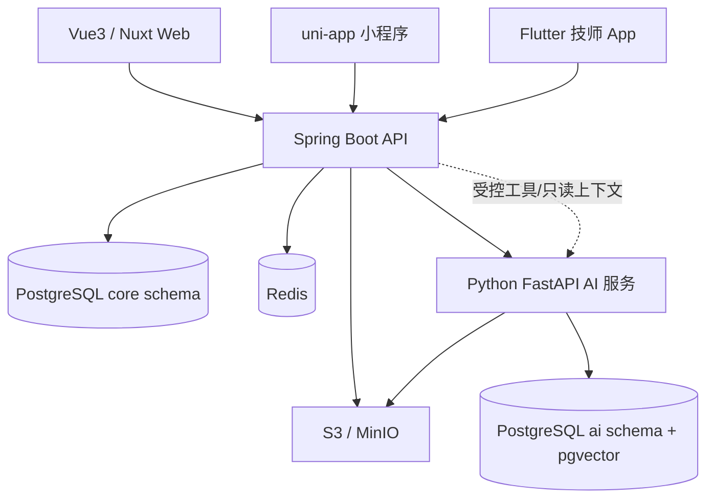

# 技术栈、版本基线与安装策略

## 1. 版本原则

本文件基线核对日期为 **2026-07-11**。这里的“最新”表示最新生产稳定、受支持且彼此兼容的组合，不表示每个包都选择最高版本号。

采用以下规则：

1. Java优先最新LTS；Node优先LTS；Flutter只用stable channel；
2. 框架只用GA/Stable，不用nightly、RC、milestone或preview特性作为项目核心；
3. 进入对应阶段时再确认最新patch，并写入锁文件；
4. 学习过程中只进行安全更新和有测试保护的bugfix升级；
5. 大版本升级单独开任务，先写影响、迁移、验收和回滚；
6. 如果最新大版本与关键依赖不兼容，选择最新兼容稳定组合，不强行拼装。

## 2. 2026年基线

| 领域 | 学习/项目基线 | 选择理由 |
| --- | --- | --- |
| Java | JDK 25 LTS（建议Temurin等OpenJDK发行版） | Java 25是当前最新LTS；Java 26是非LTS，不作为半年以上项目主线 |
| 构建 | Maven 3.9.16 | 当前GA；Maven 4仍未GA，不用于求职项目 |
| Spring | Spring Boot 4.1.x、Spring Framework 7 | 当前稳定主线，兼容Java 17—26 |
| AI for Java | Spring AI 2.0.x | 对应Spring Boot 4.0/4.1；用于概念实验和Java侧集成对照 |
| 数据访问 | MyBatis Core 3.5.x + MyBatis-Spring/Boot Starter 4.x、Flyway | “4.x”是Spring/Starter代际，不存在MyBatis Core 4；保留SQL可见性 |
| Node | Node.js 24 LTS、pnpm 11.x | 生产应用使用LTS；Node 26当前为Current而非LTS |
| Web | Vue 3稳定版、TypeScript、Vite、Vue Router、Pinia | 延续既有商业经验并强化工程化 |
| SSR | Nuxt 4稳定版 | 当前Vue全栈/SSR稳定主线，Node 22+ |
| Flutter | Flutter 3.44.x stable、Dart 3.12.x | 2026年7月当前稳定通道；进入阶段时取当期stable patch |
| 小程序 | uni-app Vue3稳定线 | 复用Vue3/TS，面向微信小程序并了解跨端差异 |
| Python | CPython 3.14当前patch、uv、FastAPI、Pydantic 2、pytest | 当前PyTorch和uv支持3.14；使用默认GIL构建，本轮不采用free-threaded变体，第三方扩展兼容性逐项验证 |
| AI编排 | 模型官方SDK、LangChain 1.x、LangGraph 1.x | 先直接SDK和显式工作流，再学有状态Agent |
| 关系数据库 | PostgreSQL 18当前patch | 当前受支持主版本，承担业务事实和AI派生数据的宿主 |
| 求职数据库桥接 | MySQL 8.4 LTS | 不维护第二套项目实现；用对照实验理解本地JD常见的InnoDB、索引、MVCC与SQL差异 |
| 向量检索 | pgvector当前稳定版 | 初期减少独立服务，并支持向量与全文混合检索 |
| 缓存 | Redis Open Source 8 | 缓存、限流、幂等和短期状态；不是业务事实来源 |
| 对象存储 | S3兼容对象存储，本地MinIO | 保存手册、图片和附件，数据库只存元数据 |
| 消息/事件 | Spring Modulith事件；RabbitMQ作外发实验 | 先模块内事件，再在真实需求下演示可靠异步 |
| 测试 | Boot BOM管理的JUnit/Mockito/Testcontainers、MockMvc、Vitest、Vue Testing Library、Playwright、Flutter Test、pytest | 优先使用框架验证过的组合，不手工覆盖到单库最新版本 |
| 可观测性 | Spring Actuator、Micrometer、OpenTelemetry、结构化日志 | 能通过traceId串联Java、Python和客户端问题 |
| 部署 | Docker Compose、Linux、Nginx、GitHub Actions | 可复现、适合个人作品和中小企业；不默认Kubernetes |

官方依据：

- Oracle将Java 25列为最新LTS，Java 26为2026年3月发布的非LTS版本：[Java SE Support Roadmap](https://www.oracle.com/in/java/technologies/java-se-support-roadmap.html)
- Maven 3.9.16是当前GA，Maven 4仍为RC：[Maven Release History](https://maven.apache.org/docs/history)
- Spring Boot 4.1要求Java 17+，支持到Java 26：[Spring Boot System Requirements](https://docs.spring.io/spring-boot/system-requirements.html)
- Spring AI 2.0对应Spring Boot 4.0/4.1：[Spring AI Getting Started](https://docs.spring.io/spring-ai/reference/getting-started.html)
- MyBatis Core当前仍为3.5.x；MyBatis-Spring/Boot Starter 4对应Spring Framework/Boot 4和Java 17+：[MyBatis Core](https://mybatis.org/mybatis-3/)、[MyBatis Starter Requirements](https://mybatis.org/spring-boot-starter/mybatis-spring-boot-autoconfigure/)
- Node官方建议生产应用只使用Active/Maintenance LTS；当前Node 24为LTS：[Node Releases](https://nodejs.org/en/about/previous-releases)
- Nuxt 4要求Node 22+并推荐Active LTS：[Nuxt Installation](https://nuxt.com/docs/4.x/getting-started/installation/)
- Flutter 2026年7月稳定版为3.44.x：[Flutter SDK Archive](https://docs.flutter.dev/install/archive)
- PyTorch当前推荐Python 3.10—3.14：[PyTorch Get Started](https://pytorch.org/get-started/locally/)
- PostgreSQL 18受支持到2030年，并应使用当前minor：[PostgreSQL Versioning](https://www.postgresql.org/support/versioning/)
- MySQL 8.4是稳定特性集的LTS线，InnoDB提供事务、行锁、MVCC和聚簇主键索引：[MySQL LTS](https://dev.mysql.com/doc/refman/8.4/en/mysql-releases.html)、[InnoDB](https://dev.mysql.com/doc/refman/8.4/en/innodb-introduction.html)
- Redis 8已取代旧Redis Stack分发方式：[Redis Open Source](https://redis.io/docs/latest/operate/oss_and_stack/)

### 最新大版本的组合风险

- Spring Boot 4.1是GA稳定版，但发布时间较新。任何第三方Starter都必须有启动测试和真实集成测试，不能根据“支持Boot 4”口号推断全部兼容。
- MyBatis Spring Boot Starter 4.x底层仍是MyBatis Core 3.5.x；计划和简历不得写成“MyBatis Core 4”。
- OpenAPI 3.2是最新规范，但springdoc、Swagger UI和代码生成器未必完整支持。学习规范时了解3.2，项目输出使用工具链实际验证通过的最高兼容版本，并通过`/v3/api-docs`回归测试。
- JUnit、Mockito、Testcontainers和Flyway优先接受Spring Boot BOM管理的版本。单个库官网版本更高，不代表与Boot组合更稳。
- JDK 25中的结构化并发仍是preview，不作为项目主路径；虚拟线程已经稳定，但仍需对数据库连接和外部API限并发。
- Flutter旧App升级必须在独立分支进行，分别处理Dart、Gradle、Android SDK、Xcode和插件变化，不一次性升级后盲修。

## 3. 技术职责与边界

### Java负责

- 身份映射、租户、组织、角色和数据权限；
- 设备、位置、型号、维护基线属性和二维码；计划性预防维护模块留到项目二期；
- 报修、工单、状态机、SLA、派单、工时和备件记录；
- 事务、幂等、审计、通知意图和最终业务写入；
- 对Web、App和小程序提供唯一公共API；
- 对Python进行服务鉴权、超时、熔断、降级和审计。

### Python负责

- 文档解析、清洗、切块、Embedding和派生索引；
- 混合检索、重排、引用和无答案判断；
- 工单分类建议、诊断检查单和报告草稿；
- Prompt、模型、索引版本和AI评估记录；
- 有状态但受控、只读优先的LangGraph工作流。

Python不得直接修改`core` schema，不得绕过Java执行派单、关闭、扣减、删除或发送。AI输出始终是建议、草稿或证据。

### 客户端负责

- Vue/Nuxt：展示和交互，不复制业务权限判定；
- uni-app：报修人的轻量流程，不做完整管理后台；
- Flutter：现场技师、设备能力和离线同步，不承担调度后台；
- 所有客户端只访问Java公共API，不直连Python、数据库或私有对象存储；
- OpenAPI生成类型/客户端，UI代码不在三端之间强行共享。

## 4. 具体库的选择

### Java后端

- Web：Spring MVC；了解WebFlux适用场景，但项目不混用两套Web栈。
- 数据：MyBatis为主，先写清晰SQL；了解JPA、Spring Data JDBC和MyBatis-Plus的取舍，不把代码生成当成SQL能力。
- 迁移：Flyway；禁止依赖ORM自动改生产表。
- 安全：Spring Security；项目优先OIDC/标准认证提供方，另做Session/JWT最小实验以理解原理。
- 模块：package-by-feature + Spring Modulith；不使用全局`controller/service/repository`大目录。
- API：REST JSON、OpenAPI、SSE；了解WebSocket但只在有双向实时需求时使用。
- 异步：进程内领域事件起步；可靠外发使用outbox，RabbitMQ只在跨进程事件阶段加入。
- 韧性：超时、有限重试、幂等、熔断和降级；禁止无界重试。

### Vue/Nuxt

- Vue 3 Composition API + `<script setup lang="ts">`；
- Vue Router、Pinia处理客户端状态；TanStack Vue Query或等价模式处理服务端状态；
- Element Plus用于管理端基础组件，ECharts用于报表；
- 表单使用明确schema和服务端错误映射，不把所有校验只放前端；
- Nuxt用于公开门户/SSR切片，Java仍是复杂业务中心；
- Vitest + Vue Testing Library验证组件行为，Playwright验证关键业务路径。

### uni-app

- Vue3 + TypeScript + Pinia；
- 重点学习小程序页面生命周期、分包、授权、网络、上传、扫码、缓存和真机差异；
- 条件编译只用于真实平台差异，不堆大量不可维护分支；
- 项目主要验证微信小程序，其他平台只了解发布差异。

### Flutter

- 采用Flutter官方推荐的UI层/数据层分离思路；
- Riverpod作为状态与依赖管理的候选实现，先理解状态边界再使用代码生成；
- go_router管理路由，Dio或等价客户端访问OpenAPI；
- Drift/SQLite保存离线工单，secure storage保存敏感凭据；
- 使用freezed/json_serializable等生成代码时必须理解生成物契约；
- 单元、Widget和Integration Test分层，至少完成Android或iOS一端真机构建。

### Python AI

- uv管理解释器、环境、依赖和锁文件；
- FastAPI + Pydantic提供内部API；
- 先使用模型官方SDK学习stream、structured output和tool calling；
- LangChain用于集成抽象，LangGraph只用于需要checkpoint/HITL的流程；
- pytest、类型检查、lint、结构化日志和OpenTelemetry与Java同等重要；
- PyTorch只覆盖张量、Dataset/DataLoader、模型、损失、优化器、训练/推理和保存加载概念。

## 5. 数据选择

### PostgreSQL作为权威库

业务事实放在`core` schema：租户、组织、用户映射、资产、工单、SLA、审计、知识元数据。AI派生数据放在`ai` schema：chunk、embedding、索引版本、prompt版本、eval run。

两个数据库角色互相禁止写入对方schema。向量索引可以删除重建，业务表不能依赖向量库作为唯一事实来源。

### MySQL求职桥接

FactoryCare不同时维护PostgreSQL和MySQL两套生产实现。Week 12使用MySQL 8.4 LTS做2小时小型对照，理解InnoDB聚簇/二级索引、MVCC与锁、字符集/排序规则、`AUTO_INCREMENT`、JSON、分页、`EXPLAIN`和SQL差异。面试回答时明确当前讨论的是哪种数据库，禁止把MySQL口诀直接套到PostgreSQL。

### Redis的边界

适用于缓存、限流计数、幂等短期状态、分布式锁的受控实验和临时会话。必须回答：

- Redis丢失后业务是否仍正确？
- 缓存何时失效，谁负责更新？
- 锁过期或客户端崩溃会怎样？
- 是否真的需要分布式锁，数据库约束能否更可靠？

### 对象存储

原始手册、图片和附件进入S3兼容对象存储。数据库只保存对象键、哈希、大小、MIME、租户、版本和生命周期状态。下载使用Java授权后生成的短时URL。

## 6. 安装时机

不在第0周一次安装全部工具，按阶段安装：

| 时机 | 安装/确认 | 验证 |
| --- | --- | --- |
| Week 00 | JDK 25、Maven 3.9.16、Git、IDE；只盘点Docker等后续工具 | `java -version`与`mvn -v`必须指向同一JDK |
| Week 07 | Spring Core与Maven依赖 | 不使用Boot的最小`ApplicationContext`和测试通过 |
| Week 08 | Spring Boot Web依赖 | 最小Boot应用、Web测试和启动验证通过 |
| Week 09 | Docker或兼容容器运行时 | `docker info`和Testcontainers烟雾测试通过 |
| Week 10 | PostgreSQL 18容器 | `psql`连接、迁移和测试容器可用 |
| Week 16 | Redis 8容器 | CLI、TTL、重启和故障实验 |
| Week 19 | Node 24 LTS、pnpm、Vue工具链 | 类型检查、测试、构建通过 |
| Week 20 | S3兼容对象存储，本地MinIO | 授权上传、私有下载、对象归属和失败测试 |
| Week 21 | Nuxt 4 | SSR开发、生产构建和Node启动通过 |
| Week 23 | HBuilderX或CLI、小程序开发者工具 | 真机或开发者工具运行 |
| Week 25 | Flutter stable、Xcode/Android工具按目标端安装 | `flutter doctor`和真机/模拟器构建 |
| Week 27 | Python 3.14、uv | `uv run pytest`和FastAPI健康检查 |
| Week 30 | pgvector与AI schema；复用对象存储 | 迁移、索引、解析取文件和ACL测试 |
| Week 34 | Nginx、OTel Collector及CI依赖 | 一键启动、trace、备份和恢复演练 |

### 本机已知问题

2026-07-11检查时：

- `java -version`为Java 21；
- Maven 3.9.16却使用Java 26；
- Node为22.x；
- Python为3.14.3；
- Docker、Flutter和其他依赖按周确认。

第0周必须先把`JAVA_HOME`、IDE项目SDK和Maven运行时统一到JDK 25。Node 22仍在支持期，但进入Web阶段时升级到当时的LTS基线。

## 7. 锁定与升级

每个项目初始化后保存：

- Java：`pom.xml`、Spring Boot parent/BOM、Spring AI BOM；
- Node：`package.json`、`pnpm-lock.yaml`、`.nvmrc`或等价版本文件；
- Python：`pyproject.toml`、`uv.lock`、`.python-version`；
- Flutter：`pubspec.yaml`、`pubspec.lock`、SDK约束；
- Docker：镜像使用明确major/minor或digest，不长期使用不可追踪的`latest`；
- 数据库：所有结构变化通过Flyway迁移，不手改共享数据库。

升级前最少满足：

1. 写明升级原因和受影响模块；
2. 查看官方迁移说明和安全公告；
3. 在独立分支升级；
4. 运行全部检查、测试、构建和关键E2E；
5. 验证数据库迁移能前滚，数据变更有备份；
6. 保留旧镜像/锁文件，能够回滚；
7. 记录ADR和最终结果。

## 8. 只了解概念、不在本轮深入的技术

计划会解释但不作为项目核心实现：

- JPA、WebFlux、GraphQL、gRPC；
- Spring Cloud、Nacos、Sentinel、Seata；
- Kafka、Pulsar、复杂消息顺序和Exactly Once；
- Elasticsearch和独立向量数据库；
- Kubernetes、Helm、Service Mesh；
- React/Next.js、React Native；
- 原生Android/iOS和小程序底层渲染实现；
- 模型微调、vLLM、GPU调度和MLOps平台。

对这些内容的合格要求是：知道解决什么问题、何时采用、引入什么成本，以及FactoryCare为什么暂时不采用。
