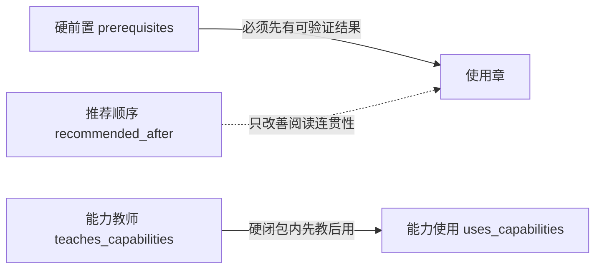

# 概念图与前置语义

当前图包含 170 个章节节点、352 条硬依赖边、154 条推荐顺序边和 3 个硬依赖根节点。

## 图例

## 关键跨卷硬边

- Spring 事务/AOP → PostgreSQL 事务与 Java 集成测试：`v05.c08.services-transactions-aop` 必须包含 `v04.c09.transactions-locks` 与 `v03.c12.java-testing-mocking`。
- pgvector 检索 → 关系数据库与索引：`v14.c06.retrieval-rerank` 必须包含 `v04.c01.relational-model`、`v04.c08.indexes-explain`。
- 小程序认证存储 → 认证与 Web 威胁模型：`v10.c03.network-auth-storage` 必须包含 `v06.c01.auth-session-password`、`v06.c02.web-security-threats`。
- Vue SFC → CSS 层叠和盒模型：`v09.c01.vite-sfc-app` 必须包含 `v07.c05.css-cascade`、`v07.c06.box-position-stacking`。
- 生产部署迁移 → Flyway 数据演进：`v15.c09.deployment-rollback-incident` 必须包含 `v04.c10.migration-jdbc-mybatis`。

完整边集不在本文件重复维护；以 [catalog.yml](catalog.yml) 为准，验证器会检查 DAG、能力首用、关键跨卷边、路线闭合和最长链。
