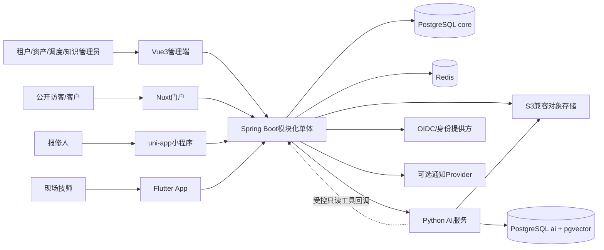
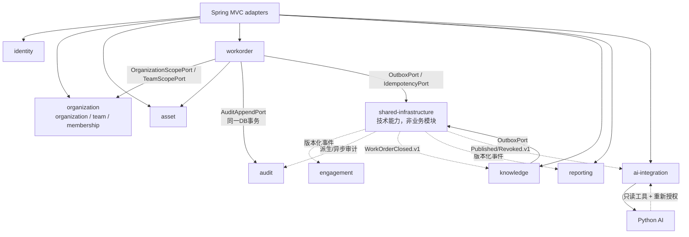

# FactoryCare逻辑架构

## 1. 系统上下文

客户端、Python、对象存储和数据库之间不存在绕过Java公共API的业务通道。Python读取业务上下文只能通过Java允许列表中的只读工具；原文读取使用Java授权的对象引用或最小权限服务身份。

## 2. Java模块依赖

约束：

- `identity`不依赖业务模块；它发布七个固定role与permission的GLOBAL只读catalog，租户只绑定不改写；
- `organization`拥有租户、组织、班组、成员关系和数据范围，不拥有密码；team只能位于同租户organization下，`TEAM`范围必须有匹配`teamId`；
- `workorder`可以通过公开接口引用`asset`和`organization`，不能直接改其表；
- `workorder.assignment`保存team快照引用；转派终止旧assignment并创建新assignment，只增加work-order version和核心审计，不改status、不写transition且不扩充12状态机；
- `audit`公开仅追加的`AuditAppendPort`；状态变更、权限变更、高风险审批等核心审计由发起模块在同一PostgreSQL事务写入，审计失败则核心命令整体回滚；
- `audit`的事件消费者只补充派生/异步证据，不能成为核心安全或状态审计的唯一来源；`engagement`和`reporting`仍只在事务后消费事件；
- `knowledge`消费关单事件生成待审核草稿，但AI失败不能回滚工单；
- `ai-integration`是唯一Java/Python适配层，不能拥有工单规则；
- `shared-infrastructure`是九个业务模块下方的技术能力，不是第十个业务模块；它持有`outbox_event`和`idempotency_record`的存储适配器，业务模块只经公开端口使用，不直接跨包访问其表；
- 禁止循环依赖和跨模块访问内部包。

## 3. 数据职责

| 存储 | 权威数据 | 可删除重建 | 禁止事项 |
| --- | --- | --- | --- |
| PostgreSQL `core` | 租户、组织/team/成员范围、资产、工单/assignment、知识版本元数据、核心审计、幂等与outbox | 仅reporting读模型等明确派生数据可重建 | Python角色写入；客户端直连；用事件补写代替核心审计 |
| PostgreSQL `ai` | 派生chunk/embedding/索引；prompt/模型登记、调用/工具证据、评估集与运行、thread/checkpoint | 只有chunk、embedding和索引具象可从已保留原文与版本化配置重建；真实模型输出、tool call、eval结果和checkpoint不可宣称可重放得到 | 作为工单或权限事实源；丢弃未过期不可重建的治理/运行证据 |
| Redis | 缓存、限流、幂等短期状态、短期会话候选 | 是 | 保存唯一业务事实 |
| S3对象存储 | `report/work_order`通用附件原文件；`knowledge_version`自身引用的不可变知识对象 | 依据版本/备份策略，不因DB元数据存在就假定可重建 | 公开桶；数据库存完整大文件；把知识文件伪装成`attachment` |
| 客户端本地库 | Flutter离线缓存和待同步命令 | 缓存可重建；未同步命令不可静默丢失 | 成为跨设备权威库 |

`source_of_truth`与`可重建`是两个不同问题：例如checkpoint不是工单事实源，但丢失后也不能凭业务表精确恢复对话流程；删除它意味着放弃该流程并在重新授权后重启，不是“重建”。

## 4. Java/Python调用方向

### Java到Python

- 分诊建议、带引用回答、报告草稿和评估任务；
- 使用短时服务身份、租户、用户scope、traceId和超时预算；
- 输出必须经过结构化Schema和Java业务验证；
- Python不可用时返回明确降级，不阻塞人工主链路。

### Python到Java

- 只允许`asset-summary`和`work-order-history`等明确只读工具；
- Python同时证明自身服务身份并转交短时原始操作者上下文；
- Java每次重新验证用户、租户、资源、数据范围和scope；
- 不提供通用SQL、任意URL、任意资源ID遍历和写操作工具；
- resume、重试或checkpoint恢复后必须重新授权。

## 5. 部署演进

当前目标是一个Java部署物、一个Python AI服务和基础依赖。只有出现独立团队/数据所有权、独立伸缩、部署频率或故障隔离的真实证据时，才评估拆服务。

迁移顺序：

1. 先用模块测试证明边界；
2. 抽取稳定公开接口与事件；
3. 建立独立数据所有权和回填/双读计划；
4. 在兼容窗口内迁移调用；
5. 观察并保留回退路由；
6. 最后删除旧路径。

本轮不实现该迁移，也不在简历中声称微服务经验。
