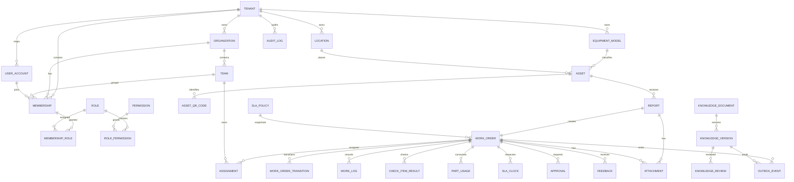

# FactoryCare逻辑数据模型

## 1. 建模原则

- 每张业务表只有一个拥有模块；其他模块通过公开API、ID或事件协作；
- 所有租户业务表显式携带`tenant_id`，唯一约束和查询同时包含租户维度；
- Java从认证上下文解析租户，普通DTO中的`tenantId`不可信；
- 当前状态与追加式历史分离；禁止直接覆盖状态却不写`work_order_transition`；
- AI索引属于派生数据，不能反向成为工单、权限或发布状态的权威源；
- 时间存储使用UTC语义的`timestamptz`，展示时转换时区；
- 精确数量、工时和金额不使用浮点数；
- 删除优先表达业务状态与保留策略，高价值审计不做普通硬删除。
- 只有catalog允许跨租户定义；每行必须显式标注`scope=GLOBAL|TENANT`，`GLOBAL`只读项由平台发布流程管理，`TENANT`项必须有非空`tenant_id`，绝不用`tenant_id=NULL`暗示“全局”。
- 七个业务`role`和`permission`是`scope=GLOBAL`的固定只读catalog；租户只在`membership_role`中绑定/撤销，不复制或改写角色定义。

## 2. 核心关系



图只表达主要关系。`membership.team_id`可空，但若`data_scope=TEAM`则必须非空，且team的`tenant_id/organization_id`必须与membership一致。外键是否跨模块物理建立，要结合迁移、删除与模块测试决定；逻辑所有权不可因为没有物理外键而消失。

## 3. 工单聚合

聚合根：`work_order`。

事务内必须一致：

- 当前状态与目标状态合法；
- 操作者权限和数据范围合法；
- 当前`version`未过期；
- 该命令要求的原因、检查项、审批或解决信息完整；
- 状态、`version`、`work_order_transition`、必要审计摘要和`outbox_event`同事务提交；审计通过`audit`公开的仅追加端口写入，任何一项失败都回滚整个命令；
- 幂等键重复时返回原结果，不重复产生副作用。

`outbox_event`和`idempotency_record`属于`shared-infrastructure`技术能力，不引入第十个业务模块。`workorder`、`knowledge`等业务模块只调用`OutboxPort`和`IdempotencyPort`，不引用其Repository、表实体或发布器实现。

`assignment`每行保存必填`team_id`与可选`technician_membership_id`。转派在同一工单事务结束旧有效assignment并创建新assignment，校验新team与技师属于同租户/组织，同时增加`work_order.version`与核心审计。转派不写`work_order_transition`、不改当前status、不新增状态或合法边；已解决/已验证/已关闭/已取消状态拒绝转派。

不要求同事务：

- 通知实际发送；
- reporting读模型更新；
- AI分诊、报告草稿或知识索引；
- 外部消息Provider回执。

## 4. 唯一状态机

主路径：

```text
CREATED → TRIAGED → ASSIGNED → ACCEPTED → IN_PROGRESS
IN_PROGRESS → RESOLVED → VERIFIED → CLOSED
```

分支：

- `IN_PROGRESS ↔ PENDING_PARTS`；
- `IN_PROGRESS ↔ PENDING_APPROVAL`；
- `RESOLVED → IN_PROGRESS`：验证驳回；
- `CLOSED → REOPENED → IN_PROGRESS`：合法重开；
- `CREATED/TRIAGED → CANCELLED`：合法取消。

每次迁移写`work_order_transition(from_status,to_status,actor,reason,occurred_at,version)`。不提供通用`PATCH status`接口。

`IN_PROGRESS -> PENDING_APPROVAL`必须创建`status=PENDING`的`approval`记录；只有具备`WORK_ORDER_DECIDE_APPROVAL`权限且范围匹配的人员才能提交命令`APPROVE|REQUEST_CHANGES`。两个命令分别持久为`APPROVED|CHANGES_REQUESTED`，都返回`IN_PROGRESS`，并保留命令、状态、理由、决定人、时间和前后状态；审批不能跳过解决、验证或关闭前置。

## 5. 知识与对象

`knowledge_document`表达稳定文档身份；`knowledge_version`表达一次不可变内容版本，包括：

- 对象键、SHA-256、大小、MIME；
- 原始文件名的安全显示值；
- 发布状态、审核状态、创建者和时间；
- 设备型号、可见范围和ACL元数据；
- 解析/索引状态只作派生状态，不决定业务发布事实。

`attachment`只是`report`与`work_order`的通用附件元数据，最终`owner_type`只允许`REPORT|WORK_ORDER`。上传阶段`purpose`只允许`REPORT_CREATION|REPORT_SUPPLEMENT|WORK_ORDER`：

- `REPORT_CREATION`可在报修尚未创建时使`owner_type/owner_id`暂空，但必须绑定短时上传会话/请求主体，不可下载、引用或被AI处理；
- 创建report的事务必须校验同租户、同主体/上传会话、`AVAILABLE`、未过期且未绑定，然后原子转为`owner_type=REPORT, owner_id=<reportId>`；重试不重复绑定；
- `REPORT_SUPPLEMENT|WORK_ORDER`在创建上传意图时就必须有已存在且已授权的对应owner；过期未绑定`REPORT_CREATION`对象按manifest安全清理；
- 知识文件不建模为`attachment`且不存在knowledge purpose；它由`knowledge_version.object_key/sha256/size/mime`直接定义不可变对象身份与生命周期。

撤回先让Java发布状态变为不可见并发出`KnowledgeDocumentRevoked.v1`，Python立即过滤不可见版本，再异步清理派生索引。

## 6. AI派生数据

`ai` schema同时包含可重建派生物与不可重建运行/治理证据：

- `source_document/source_version`、`chunk`、embedding与索引具象是派生物；只有已保留原文、ACL、切分配置和模型版本都可用时才能重建；
- `prompt_version`、`embedding_model_version`、`eval_dataset`和`eval_case`是人工管理的版本化输入，必须保留，不是可从chunk倒推的派生数据；
- `model_call/tool_call`和`eval_run/eval_result`记录当时的供应商输出、版本、延迟、成本、引用、工具参数摘要和人工结论；非确定模型无法精确重放，这些是不可重建证据；
- `agent_thread/checkpoint`只有LangGraph流程需要时创建。它们不是工单事实源，但也不可精确重建；丢失时必须标记旧流程终止，重新授权并从安全节点重启。

Python数据库角色对`core` schema没有写权限。读取业务事实也不通过数据库授权，而是调用Java只读工具。

## 7. 并发与幂等

| 场景 | 主机制 | 失败行为 |
| --- | --- | --- |
| 两个调度员同时派单 | `version`条件更新 | 一个成功，另一个409并刷新 |
| 小程序重复报修 | `Idempotency-Key` + 请求指纹 + 唯一约束 | 返回原结果或拒绝键复用不同请求 |
| Outbox重复投递 | `event_id`唯一 + 消费记录 | 幂等跳过，不承诺Exactly Once |
| Flutter离线重放 | 客户端命令ID + 服务端幂等 + 版本 | 冲突进入人工处理，不静默覆盖 |
| 文档发布事件重复 | `event_id/source_version`唯一 | 不重复切块或embedding |
| Agent checkpoint恢复 | thread/checkpoint版本 + 重新授权 | 不重复外部副作用；过期/丢失checkpoint不伪装重建，终止旧流程并安全重启 |

## 8. Reporting指标口径

`reporting_work_order_daily`是可重建的按日读模型，至少保存`metric_date`、`organization_id`、`team_id`、`equipment_model_id`、`priority`以及以下分子/分母，不只保存已计算比率：

| 指标 | 最小字段 | 口径与不变量 |
| --- | --- | --- |
| SLA达标 | `sla_eligible_count`、`sla_met_count`、`sla_breached_count` | 只统计适用同一策略快照的工单；暂停时段不双计 |
| 首次解决 | `resolved_count`、`first_time_resolved_count` | 在统计窗口内第一次解决后未驳回且未重开；始终保留分母 |
| 重复故障 | `closed_count`、`repeat_failure_count` | 使用版本化的设备+故障分类+时间窗口规则，不靠文本模糊猜测 |
| 知识命中 | `knowledge_answer_count`、`knowledge_hit_count` | “命中”要求有效、同租户、已发布的source version被最终回答引用，不把只召回未采用算命中 |
| AI采纳 | `ai_suggestion_count`、`ai_decided_count`、`ai_adopted_count` | 建议ID/模型/prompt版本与最终人工动作显式关联；采纳率分母是已决定建议，无决定不得默认为未采纳 |

读模型可从已保留业务事实与版本化事件重建；但作为来源的审批、迁移、AI建议/人工决定和引用证据不可删除后靠报表反推。

## 9. 数据保留与删除

- 审计日志只追加，按合规和演示环境策略保留；
- 原始附件和知识版本按租户授权、业务引用和生命周期删除；
- AI chunk/embedding随撤回先不可见，之后可重建/清理；
- prompt/tool日志默认不保留完整敏感内容，但在保留期内必须保留脱敏调用、版本、工具摘要和评估结果证据，不宣称可重建；
- 演示种子数据可一键清空重建；
- 所有删除需求先写影响、备份、迁移、验证和回滚，不使用无条件级联删除替代设计。
