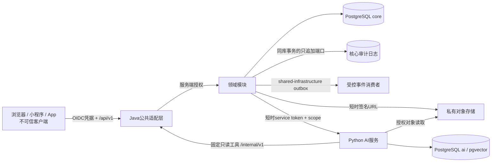

# FactoryCare威胁模型

> 状态：施工前候选基线。它定义要验证的安全性质，不代表系统已经通过渗透测试或达到任何合规认证。

## 1. 范围与安全目标

本模型覆盖Vue/Nuxt管理端、uni-app报修端、Flutter技师端、Spring Boot模块化单体、Python AI服务、PostgreSQL、Redis、对象存储和事件/outbox链路。首要目标按优先级排列：

1. **租户隔离**：任何客户端、后台任务、报表、AI检索和工具回调都不能读取或修改其他租户的数据；
2. **工单完整性**：状态只能经命令和状态机转换，并发、重试和离线同步不能造成重复副作用或覆盖新版本；
3. **身份与最小权限**：认证主体、成员关系、角色和数据范围在服务端重新判定，不信任客户端声明；
4. **知识与附件安全**：未发布、已撤回、恶意或越权`knowledge_version`不能进入回答；`report/work_order`私有附件不能被永久公开URL绕过授权；两类对象元数据不混用；
5. **AI有界**：模型输出只是非可信建议；工具只读、参数固定、结果有上限，证据不足时可以安全失败；
6. **可追责与可恢复**：高风险动作、AI调用、权限变更和事件恢复都有不可抵赖的最小审计证据。

## 2. 受保护资产

| 资产 | 影响 | 保护要求 |
| --- | --- | --- |
| 租户、组织、成员和角色 | 越权可扩散到全系统 | 强租户边界、最小权限、权限变更审计 |
| 设备、位置、二维码 | 暴露生产位置或允许伪造报修 | 不可预测标识、二维码轮换、资源级授权 |
| 工单、联系人、附件和处理记录 | 含个人信息与现场信息 | 数据范围、字段最小化、短时下载授权 |
| 工单状态、工时、备件和SLA | 影响业务事实与绩效 | 事务、乐观锁、幂等、追加历史 |
| 手册、知识版本和审核结论 | 可能包含安全操作步骤 | 版本不可变、发布门、撤回传播 |
| AI索引、提示、调用/工具、引用和评估数据 | 可泄密、被投毒、误导或丢失事故证据 | 租户过滤、来源追踪、版本、保留策略；不把非确定运行证据标为可重建 |
| service token、OIDC令牌、对象存储凭据 | 泄露会绕过边界 | 短时、轮换、最小scope、禁止落日志 |
| 审计与追踪记录 | 事故调查依据 | 追加写、访问受限、敏感字段脱敏 |

## 3. 信任边界与数据流

必须在每次跨边界时重建或验证安全上下文：客户端不能提供可信`tenantId`；Python不能把普通请求字段升级为授权；对象存储不能仅凭对象键开放；事件消费者不能跳过租户与Schema校验。受保护的状态/权限/审批操作在业务事务内经`audit`公开追加端口写核心审计；后续事件只能补充派生/异步证据。

## 4. 滥用者与假设

- 未登录网络攻击者：枚举二维码、撞库、上传恶意内容、消耗AI与上传资源；
- 已登录低权限成员：修改ID、组织范围或工具参数尝试横向/跨租户访问；
- 被攻陷的客户端：伪造状态、重放离线命令、泄漏本地缓存；
- 恶意文档作者：把Prompt Injection、外链或危险步骤写入知识文档；
- 被攻陷的Python服务/模型Provider：扩大检索、调用未授权工具或泄漏上下文；
- 内部高权限人员：批量导出、改角色或掩盖操作；
- 并非假设Redis、消息交付、移动网络或模型输出可靠；数据库、OIDC Provider和对象存储仍需独立加固与备份。

## 5. 风险登记与验证

严重度：`P0`会造成跨租户或核心业务事实失控；`P1`造成敏感数据、权限或完整性重大影响；`P2`局部影响或需要其他条件。状态均为“待实现/待验证”。

| ID | STRIDE | 场景 | 等级 | 设计控制 | 必须提供的验证证据 |
| --- | --- | --- | --- | --- | --- |
| TM-01 | S/E | 客户端替换`tenantId`、资源ID或组织ID读取别的租户 | P0 | tenant来自认证成员上下文；Repository默认带tenant；资源级授权；拒绝跨租户关联 | 每类资源的跨租户负向集成测试；SQL/日志证明零返回 |
| TM-02 | E | 用户拥有角色但不在目标组织数据范围内 | P0 | RBAC与data scope同时判定；默认拒绝；服务层而非只在UI隐藏 | 权限矩阵参数化测试，覆盖角色×范围×动作 |
| TM-03 | S | 伪造OIDC subject、过期token或删除后的成员关系 | P0 | 验签并固定issuer/audience；短时token；每次请求解析当前成员；禁用立即生效 | 错误issuer/audience/过期/已撤销成员测试 |
| TM-04 | T | 使用通用PATCH直接把工单改为`CLOSED` | P0 | 不暴露任意status写接口；命令映射到唯一状态机；转换表追加写 | 每个非法边的契约测试与数据库不变断言 |
| TM-05 | T/R | 双调度员同时派单导致静默覆盖 | P1 | `version`乐观锁；冲突返回稳定错误；转换与assignment同事务 | 并发测试只有一个成功，失败方收到`VERSION_CONFLICT` |
| TM-06 | T | 网络重试/双击/离线回放产生重复工单、工时或事件 | P1 | `Idempotency-Key`绑定主体+路由+请求摘要；唯一约束；响应重放；outbox同事务 | 相同键同请求返回同结果；异请求同键拒绝；事件仅一条 |
| TM-07 | I | 顺序可枚举二维码暴露资产或允许冒名报修 | P1 | 随机高熵token、哈希存储、可轮换/失效、速率限制；解析只返回报修所需最小信息 | 枚举/旧码/跨租户/速率限制测试 |
| TM-08 | T/I | 上传可执行脚本、双扩展、压缩炸弹或伪造MIME | P1 | 大小/数量/扩展/MIME/魔数校验；隔离区；恶意扫描；随机对象键；禁止内联执行 | EICAR等测试样本、超限、MIME不符、压缩炸弹负向测试 |
| TM-09 | I | 永久公开URL、日志或Referer泄露私有附件 | P1 | 私有bucket；服务端授权后生成短时URL；Content-Disposition；日志脱敏 | URL过期、撤权后拒绝、跨租户对象键测试 |
| TM-10 | T | 知识版本被原地修改，已审核内容和索引不一致 | P1 | 发布版本不可变；修改创建新版本；发布/撤回事件；索引记录sourceVersion | 数据库约束测试；版本哈希与引用一致性检查 |
| TM-11 | I/E | RAG检索漏掉tenant/model/publication过滤 | P0 | 过滤条件由服务端上下文注入；未发布/撤回先过滤后排序；独立AI库角色 | 10+跨租户评估集必须零召回；撤回传播SLO测试 |
| TM-12 | E | 文档Prompt Injection要求忽略规则、泄漏密钥或调用工具 | P0 | 文档视为数据；系统规则隔离；工具允许列表；引用输出；拒绝秘密/跨范围请求 | 注入评估集；确认无越权工具调用和秘密回显 |
| TM-13 | E/T | 模型构造任意SQL、URL或写操作工具 | P0 | 仅两个固定只读工具；JSON Schema参数；结果/页数/超时上限；禁止通用HTTP/SQL | 未知工具、额外字段、SSRF地址、写入意图均拒绝 |
| TM-14 | S/E | Python复用过期上下文或伪造原用户/租户 | P0 | Java签发短时、有audience/nonce/scope的调用上下文；每次回调重验主体与当前授权 | 过期、重放、错audience、权限变化后的回调测试 |
| TM-15 | I | 把token、联系方式、完整Prompt或文档正文写入日志 | P1 | 日志字段允许列表；认证头/URL签名/PII脱敏；生产错误不回显堆栈 | 自动日志扫描与异常路径检查 |
| TM-16 | R/T | 管理员改权限、发布知识或人工采纳AI后否认 | P1 | 高风险动作二次确认；发起模块在同DB事务经`AuditAppendPort`追加actor/target/before-after摘要/trace；事件消费只补派生证据 | 审计写失败时业务整体回滚；核心审计不依赖消费者可用；审计修改权限负向测试 |
| TM-17 | D | AI、上传、搜索或SSE被滥用导致资源耗尽 | P1 | 按主体/租户配额；大小与并发上限；超时/熔断/背压；核心工单可降级 | 压测与故障注入；Python不可用仍可人工处理工单 |
| TM-18 | T | outbox重复、乱序或毒消息污染报表/通知/索引 | P1 | 至少一次语义；`eventId`幂等；Schema版本校验；有限重试与隔离；可重建读模型 | 重复/乱序/未知版本/毒消息恢复测试 |
| TM-19 | I | App离线缓存、截图或本地数据库泄露工单与附件 | P1 | 最小缓存；系统安全存储保存令牌；数据库/文件加密能力；退出/远程禁用清理；日志不含正文 | 真机安全检查、退出清理、备份与调试日志检查 |
| TM-20 | E | 高权限账户或service token长期不轮换且权限过宽 | P0 | 生产不使用共享人类账户；密钥管理器；短时凭据；scope；轮换与紧急吊销 | 权限清单、轮换演练、吊销后请求失败 |
| TM-21 | T/I | 备份未加密、恢复到错误租户或恢复后权限漂移 | P1 | 加密备份；隔离恢复环境；恢复验证租户/角色/对象引用；受控销毁 | 定期恢复演练报告与抽样一致性结果 |
| TM-22 | S/T | 不受信任的Webhook/Provider回调伪造发送结果 | P2 | Provider签名/时间窗/nonce；只更新发送记录，不直接改变工单状态 | 签名错误、重放和超时测试 |
| TM-23 | E/I | 把`tenant_id=NULL`或伪造`GLOBAL`当成跨租户catalog，借全局权限/模型项越权 | P0 | catalog显式`scope=GLOBAL|TENANT`；GLOBAL只读且仅平台发布流程可改；TENANT行必须非空tenant | 伪造scope、租户角色改GLOBAL、空tenant的TENANT行均拒绝 |
| TM-24 | E/I | Redis缓存键遗漏tenant/scope/version，或权限变更后继续返回旧敏感投影 | P0 | 缓存仅派生数据；键必含tenant+资源+版本；敏感读取先重新授权；权限不以缓存为唯一依据 | 双租户同ID/同名缓存测试；禁用成员后立即拒绝；Redis不可用时安全降级 |

## 6. 关键安全不变量

以下不变量应直接变成自动化测试名称，而不是只存在于文档：

1. `tenant A`的任意身份对`tenant B`的ID得到拒绝或不可区分的不存在，绝不返回对象摘要；
2. UI是否显示按钮不影响授权结果；直接调用API仍必须拒绝；
3. 任何状态变化都在同一数据库事务产生一条`work_order_transition`并经`AuditAppendPort`写必要核心审计，失败则全部回滚；事件消费不是该审计唯一来源；
4. 同一幂等键不能绑定两个不同请求摘要；
5. 关闭工单和发布知识必须由人类授权动作触发，模型不能直接执行；
6. 已撤回知识在传播SLO后不得出现在新回答或引用中；
7. Python和模型永远不能直接访问`core` schema，也没有写业务事实的工具；
8. token、签名URL、密钥、完整联系方式和未脱敏文档正文不进入可搜索日志。

## 7. 安全质量门

| 阶段 | 放行条件 |
| --- | --- |
| 本地/PR | 静态秘密扫描、依赖漏洞检查、权限参数化测试、非法状态转换、Schema与上传负向测试通过 |
| 集成环境 | OIDC错误场景、跨租户、对象存储授权、幂等并发、outbox恢复、AI工具回调全部有证据 |
| 发布候选 | P0风险无未解释缺口；P1有负责人和期限；备份恢复、密钥吊销与AI降级演练通过 |
| 上线后 | 监控授权拒绝激增、上传隔离、AI越权/注入指标、事件积压、审计缺口；定期复测 |

任何P0测试失败立即阻断发布。不能用“只有演示数据”替代租户隔离、凭据和上传控制。

## 8. 隐私与保留原则

- 联系方式只为报修沟通收集，列表默认遮罩，导出需要单独权限与审计；
- AI请求优先发送结构化摘要和必要片段，不默认发送完整附件、联系人或审计日志；
- 生产数据不得直接复制到评估集；评估与种子数据使用自建或授权、去标识内容；
- 为工单、附件、模型调用和审计分别定义保留期；到期删除必须处理对象存储和AI派生索引；
- 删除业务原文后，向量、chunk、缓存和备份按制度完成失效或到期，不把向量当匿名数据。

## 9. 暂未声称完成

- 未选择具体OIDC、WAF、恶意文件扫描、密钥管理和短信/推送Provider；
- 未进行第三方渗透测试、移动端逆向测试、合规或工业控制安全认证；
- 未承诺端到端加密、硬件密钥、数据驻留或灾备等级；
- 上述选择必须在部署环境已知后补充风险、成本、迁移与回滚，不得从本文推断为已实现。
