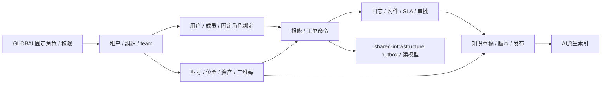

# FactoryCare演示与测试种子数据计划

> 本文件规定如何生成可信、可重置、无真实隐私的演示数据，不直接包含数据库脚本。种子数据不是测试fixture，也不证明性能或AI准确率。

## 1. 目标与约束

- 一条命令在本地/演示环境重复生成相同业务图，第二次执行不重复插入；
- 同时包含成功链、失败边界、跨租户陷阱、并发版本和全部工单状态；
- 任何姓名、电话、公司、设备序列、手册和维修内容都是虚构或明确许可；
- `prod` profile硬性禁止运行seed/reset；演示账户凭据从环境变量注入，不提交仓库；
- 所有业务表有`tenant_id`的真实关联，不能靠一个默认租户让过滤缺陷隐身；
- 种子生成器使用公开应用服务或专用受控导入端口，避免绕过状态机拼出不可能历史。

## 2. 数据集版本

种子版本标记为`factorycare-demo-v1`。每次破坏性修改：

1. 写变更原因与受影响验收ID；
2. 升版本而不是静默改变已有标签含义；
3. 更新期望数量/校验摘要；
4. 删除并重建本地数据，不在演示库上写复杂兼容迁移；
5. AI评估数据集单独版本化，不能因演示好看而改标准答案。

稳定ID在非生产种子中由`UUIDv5(namespace, seed_label)`生成，例如`tenant/qinglan`。这让截图、E2E和引用可复现；生产ID仍使用安全随机生成策略。

## 3. 两个对称租户

| 标签 | 虚构名称 | 组织 | 用途 |
| --- | --- | --- | --- |
| `tenant/qinglan` | 青岚精密制造（演示） | organization：南京一厂→装配车间；team：设备保障组、机修二组 | 主要演示链，数据较完整 |
| `tenant/jiangyou` | 江右园区服务（演示） | organization：南昌园区→动力中心；team：维修班组 | 跨租户负向、不同权限与缺失知识 |

两个租户故意拥有同名“空压机A-01”、同型号编号和同标题手册，但ID与内容不同。任何只按名称/型号查询而遗漏tenant的实现都会在负向测试中暴露。

## 4. 身份、角色与数据范围

平台seed只生成一份`scope=GLOBAL`的七角色、permission和role-permission固定catalog；租户seed不复制、改名或改写它们，只创建租户内`membership_role`绑定。绝不用空`tenant_id`猜测scope。每个演示身份只有完成场景所需的最小角色和一个可选team：

| 账号标签 | 角色 | organization / team | 数据范围 | 关键场景 |
| --- | --- | --- | --- | --- |
| `qinglan/admin` | 租户管理员 | 南京一厂 / 无 | TENANT | 组织、team、成员、固定角色绑定 |
| `qinglan/asset` | 资产管理员 | 南京一厂 / 无 | ORGANIZATION | 型号、位置、设备与二维码 |
| `qinglan/dispatcher` | 调度员 | 南京一厂 / 设备保障组 | ORGANIZATION | 分诊、team派单/转派、SLA |
| `qinglan/knowledge` | 知识管理员 | 南京一厂 / 无 | TENANT | 审核、发布、撤回 |
| `qinglan/tech-a`、`tech-b` | 现场技师 | 装配车间 / 设备保障组、机修二组 | TEAM | App、派单/转派、并发和越权 |
| `qinglan/reporter-a`、`reporter-b` | 报修人 | 装配车间 / 无 | SELF | 小程序所有权 |
| `qinglan/auditor` | 审计/主管 | 南京一厂 / 无 | ORGANIZATION | 验证、报表、审计 |

`jiangyou/*`生成同构但更小的账号集。另生成：已禁用成员、无角色成员、`team_id=NULL + ORGANIZATION scope`的合法成员，以及`TEAM scope`分别缺teamId/指向已禁用team/他organization/他tenant的四类负fixture。生产OIDC不由seed创建密码；本地身份适配器通过外部环境变量映射这些标签。

## 5. 资产与位置

每租户最低：

- 3个带稳定code/version的`equipment_model`：螺杆空压机、离心泵、数控加工中心；两租户故意复用code以验证唯一约束含tenant；
- 3层带稳定code/version的`location`树：园区/工厂 → 车间/动力中心 → 具体区域；另有循环父节点和他租户父节点负fixture；
- 12个`asset`：`ACTIVE` 10（其中2个存在处理中的维修工单，资产状态仍是`ACTIVE`）、`INACTIVE` 1、`RETIRED` 1；不生成`MAINTENANCE`等契约外资产状态；
- 每个有效资产一个当前二维码；至少一个已轮换/撤销旧码；
- 同序列号只在租户内唯一，两个租户故意复用展示编码`A-01`；
- 2个即将过保、1个未知保修期，以覆盖空值和时间边界。

二维码只保存哈希后的随机token。明文token由种子输出到本地受限的演示清单，不能写进数据库日志或生产构建产物。

## 6. 工单与合法历史

每租户至少生成30张工单，覆盖12个状态和以下业务族：

| 场景族 | 数量下限 | 设计点 |
| --- | ---: | --- |
| 新建/待分诊/已派单 | 6 | 不同优先级、缺少信息、AI建议未采纳 |
| 接单/处理中 | 5 | 两名技师、工作日志、检查项、附件 |
| 等待备件/待审批 | 4 | SLA暂停、恢复前状态；待审批含`PENDING`、命令`APPROVE|REQUEST_CHANGES`及对应持久状态`APPROVED|CHANGES_REQUESTED`、请求人/决定人/理由/核心审计 |
| 已解决/已验证 | 4 | 验证与驳回前置、解决证据 |
| 已关闭 | 7 | 按时/超时、首次解决/重复故障、AI采纳差异 |
| 重开 | 2 | 必须从合法关闭历史进入 |
| 已取消 | 2 | 分别从`CREATED`和`TRIAGED`进入 |

所有非初始状态必须生成从`CREATED`开始的完整合法`work_order_transition`链，`from_status`、`to_status`、actor、reason、occurred_at严格递增。不得直接插入一行`CLOSED`工单而没有历史。

需要固定的陷阱数据：

- 两个调度员读取同一`version`的待派单工单，供并发测试建立起点；
- 一张由设备保障组/tech-a转派到机修二组/tech-b的非终态工单：旧assignment已结束、新assignment有team_id、work-order version递增、核心审计存在，但status和transition行数不因转派改变；
- 同一报修人的相似请求但不同幂等键，不能被错误去重；
- 同一幂等键对应的已保存请求摘要与响应，供重放验证；
- 已关闭后重开的工单，报表不能把它误算为永久完成；
- 跨UTC日界线和Asia/Shanghai展示日界线的SLA时间；
- 联系方式完整值只在详情授权投影可见，列表期望值为遮罩形式。
- 至少一条报修补充信息和一条报修人反馈，用于验证追加语义、所有权和重复提交；
- 一条可用于SSE断线续传的固定迁移摘要序列，含过期cursor和无权订阅对照。

## 7. 知识、附件与事件

每个租户最低生成：

- 3份自编短手册，每份2个不可变版本；
- 1个草稿、1个待审核、2个已发布版本、1个已撤回版本；
- 发布版本关联设备型号；撤回版本仍保留业务历史但不可检索；
- 2篇由关闭工单产生但尚未审核的AI知识草稿；
- 三类attachment purpose都有fixture：`REPORT_CREATION`在上传阶段暂无owner并在创建report后绑定为REPORT；`REPORT_SUPPLEMENT`创建意图时已有REPORT owner；`WORK_ORDER`已有WORK_ORDER owner；最终`owner_type`只取`REPORT|WORK_ORDER`；
- 另有他主体REPORT_CREATION重绑、过期未绑定、缺owner的REPORT_SUPPLEMENT、知识purpose、MIME不符和超限元数据fixture（恶意二进制不提交仓库）；
- 每个知识文件对应独立`knowledge_version`对象键、哈希、大小与MIME；不为它们生成attachment行，另准备1个错哈希待绑定对象作负向fixture；
- 六类核心事件的合法样例；重复`eventId`、乱序交付和未知版本放在测试fixture而非正常seed。

对象存储键使用`tenant/{tenantId}/...`只是运维组织方式，授权仍以数据库元数据与当前主体为准。所有已发布知识记录内容哈希、source version和许可说明。

## 8. AI派生数据与评估分离

- 普通演示索引可从已发布知识重建，不直接写死embedding；
- `ai` schema的chunk/embedding/索引具象是派生数据；prompt/model catalog、评估集/case是需保留的版本化输入，不复制联系方式；
- 两租户存在语义高度相似但事实不同的段落，用来证明tenant过滤；
- Prompt Injection样本文档只能位于专用安全评估数据集，默认演示搜索不展示；
- 至少80条最终AI评估集按`PROJECT_SPEC.md`单独生成，含期望来源/拒答/安全标签；
- 运行真实模型产生的`model_call/tool_call/eval_run/eval_result`不是seed，而是带时间戳、版本和trace的不可精确重建证据；不得用下次seed/reset伪造原运行。
- `agent_thread/checkpoint`同样不进普通seed；只在恢复测试现场创建，丢失后验证安全重启而非伪装重建。

## 9. 契约与报表预期fixture

种子标签必须能稳定支撑公共/内部契约的主能力：登录/登出/当前用户，organization/team/membership/固定role绑定，equipment model/location/asset/二维码，报修创建/补充/验证/反馈，team派单/转派、工单显式命令与SSE，三类attachment purpose，知识上传/绑定/发布/撤回/下载，报表，以及AI分诊/流式回答/报告草稿/评估/两个只读工具。路由与DTO始终以OpenAPI为源，seed只维护资源图和期望行为。

为下列标签输出可机读期望值，报表重建前后逐字段比较：

| 固定标签 | 必须证明的预期 |
| --- | --- |
| `metrics/sla-met`、`metrics/sla-breached`、`metrics/sla-not-applicable` | `sla_eligible_count/sla_met_count/sla_breached_count`只计适用策略样本 |
| `metrics/first-resolution`、`metrics/rejected-resolution`、`metrics/reopened` | `resolved_count/first_time_resolved_count`不把驳回或重开误算首次解决 |
| `metrics/repeat-in-window`、`metrics/repeat-outside-window`、`metrics/different-fault` | `repeat_failure_count`仅计版本化规则匹配项 |
| `metrics/knowledge-cited`、`metrics/knowledge-retrieved-only` | `knowledge_answer_count/knowledge_hit_count`仅把最终有效引用计命中 |
| `metrics/ai-adopted`、`metrics/ai-rejected`、`metrics/ai-pending` | `ai_suggestion_count/ai_decided_count/ai_adopted_count`保留待决定，采纳率分母只含已决定 |

## 10. 生成顺序与幂等

实现要求：

1. 以稳定`seed_label`查找或使用稳定UUID；已存在且版本相同则跳过；
2. 每一阶段在独立、可诊断的事务边界执行，失败报告标签；
3. 工单状态通过领域命令推进，可为seed使用Clock注入历史时间；
4. outbox由业务模块经`shared-infrastructure` 的公开端口在正常事务产生，并用测试消费者构建读模型；seed不跨包直写outbox表；
5. 完成后输出版本、各表/状态数量、哈希摘要和可用演示账号标签；
6. 第二次执行数量与摘要不变。

## 11. Reset与生产保护

- 允许环境：`local`、临时CI、明确标记的`demo`；
- 同时要求profile允许、数据库标记`factorycare.seedAllowed=true`、交互确认或CI一次性token；
- 检测到生产host、生产数据库标签或未知环境立即退出；
- reset只删除带当前seed namespace/专用数据库的数据；推荐本地直接重建容器，不写通用`TRUNCATE CASCADE`入口；
- 对象存储按seed manifest精确删除，不能删除整个共享bucket；
- reset前后输出数据库标识与计划影响，日志不打印凭据或二维码明文。

## 12. 机器校验清单

种子完成后自动断言：

- 两个租户均存在且每个业务行tenant不为空；跨租户复合外键无违规；
- 全平台只有一份七角色GLOBAL catalog且哈希与[权限矩阵](../security/permission-matrix.csv)同步；各租户只有membership-role绑定；
- 每个team的tenant/organization存在；`TEAM scope`成员有匹配启用teamId，合法非TEAM成员可无team；
- GLOBAL/TENANT catalog的scope与tenant约束全部成立，租户seed没有改写GLOBAL行；
- 12个状态全部覆盖，所有transition属于唯一合法边；`PENDING_APPROVAL`必须有`PENDING|APPROVED|CHANGES_REQUESTED`合法approval和对应核心审计；
- 每个assignment有team_id；转派样本只改有效assignment/work-order version/审计，不新增transition或改status；
- 每个工单当前状态等于最后一条transition目标状态；
- `eventId`唯一、事件tenant/aggregate存在、关闭事件只属于真正关闭事务；
- 发布知识有不可变版本和哈希，撤回版本不在当前可检索集合；
- 对象manifest分别与数据库`report/work_order attachment`及`knowledge_version`对象引用对应，知识对象无attachment行，两类均无孤儿公开对象；
- attachment purpose只有三种；最终owner_type只有REPORT/WORK_ORDER，非REPORT_CREATION无空owner，已成功创建report引用的REPORT_CREATION全部已幂等绑定为REPORT；
- 第二次seed前后关键表数量和内容摘要一致；
- reporting的SLA、首次解决、重复故障、知识命中、AI已决定/采纳分子分母与预期fixture一致；
- 用A身份查询B的资产、工单、知识和AI索引均为零。

## 13. 明确不做

- 不冒充真实制造企业、真实故障统计或真实客户案例；
- 不用随机“脏数据”替代有目的的边界fixture；
- 不在仓库提交通用密码、生产token、真实手机号或可识别照片；
- 不用种子数据跑出的延迟宣称生产性能；
- 不让AI自动生成评估标准答案并同时给自己评分。
